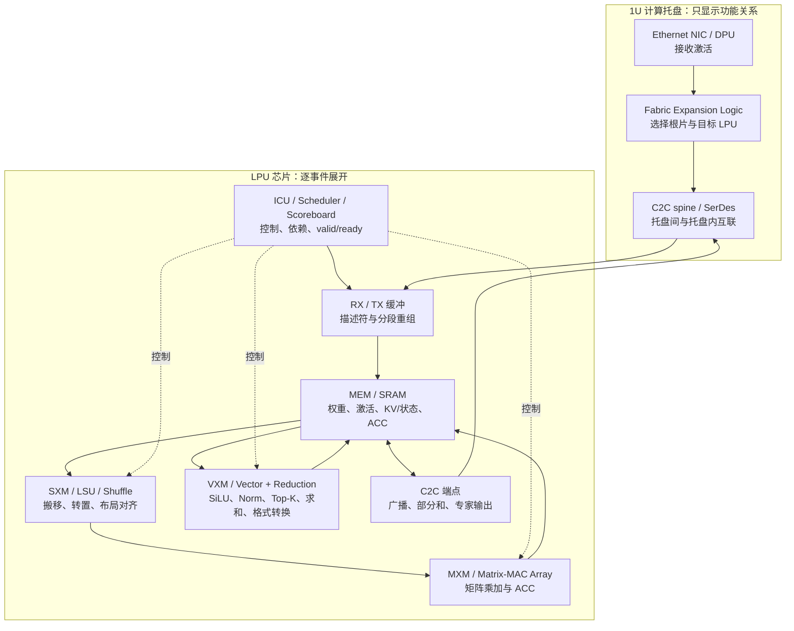
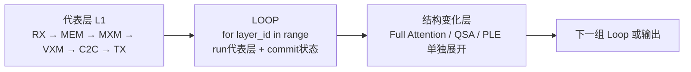
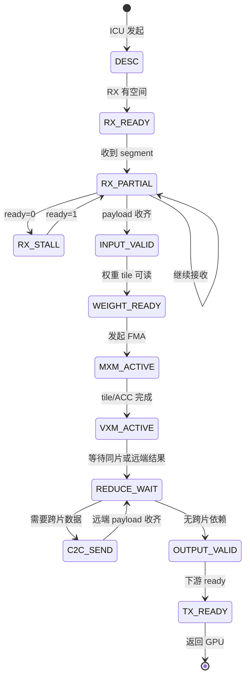
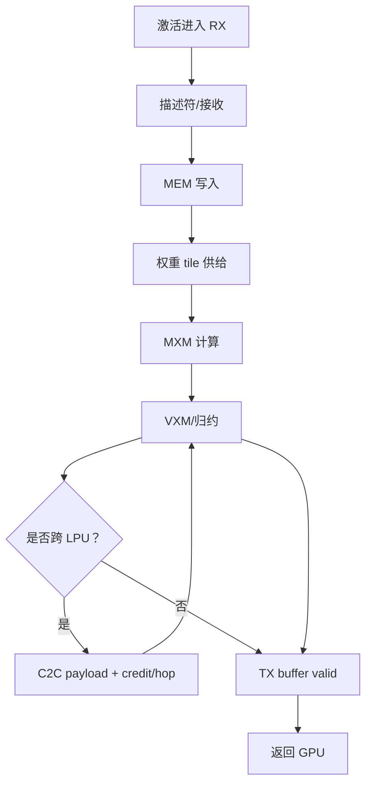

# LPU 核心数据流规格

版本：0.1  
范围：重点解释 Groq 3 LPX 内部 LPU；用户、Host、GPU 只保留必要的输入输出边界  
状态：交互实现前的数据和性能基线

关联文档：

- [数据流基线规格](数据流基线规格.md)
- [芯片研发性能与数据通路规格](芯片研发性能与数据通路规格.md)

## 1. 这版的观察范围

芯片研发工程师真正需要复核的是进入 LPU 之后发生了什么。因此本版把上下游压缩成两个简单硬件框：

| 范围 | 页面只显示 | 页面不展开 |
| --- | --- | --- |
| 用户 → Host | 用户终端、服务 NIC、Host CPU/DRAM、一次性 Token ID | HTTP/TLS 字段、CPU 微架构、服务器主板细节 |
| Host → GPU | PCIe/DMA、GPU 输入缓冲、GPU Attention/状态框 | Rubin GPU 内部 SM、HBM bank、未公开 GPU 微架构 |
| GPU → LPX | GPU 输出一个具名激活向量，沿 Ethernet 到 LPX | GPU 内部 kernel 调度、Ethernet 实际封包格式 |
| LPX/LPU | 机架 → 托盘 → Fabric → LPU 接收 → MEM/SXM/MXM/VXM/ICU/C2C → 返回 | 未公开的 ISA、bank 地址、阵列尺寸、真实布线 |
| LPX → GPU → 用户 | FFN/MoE 输出激活、GPU 残差/词表头、Host 采样、用户输出 | 把 LPU 画成直接产生文本 |

## 2. 上游简化边界


### 2.1 上游只交给 LPU 什么数据

对 LPU 来说，输入不是 Prompt、字符或 Token ID，而是当前层 Attention/状态之后的激活和控制描述符：

| 对象 | 27B Decode | Flash-Next Decode | 由谁产生 | 进入 LPU 的位置 |
| --- | ---: | ---: | --- | --- |
| `activation_x` | `[1,5120]` BF16 = 10240 B | `[1,2560]` BF16 = 5120 B | GPU Attention/状态路径 | LPX RX/MEM |
| `layer_id` | 0–63 | 0–47 | Host/GPU 运行时 | ICU/计划表 |
| `mode` | Prefill 或 Decode | Prefill 或 Decode | Host | ICU |
| `shard_plan` | TP2 中间通道范围 | EP8/EP16 示例或实际部署表 | 编译/部署阶段 | Fabric/ICU |
| `flow_id` | 请求、层、Token、方向 | 请求、层、Token、方向 | 运行时 | RX/TX 描述符 |
| 权重 | 由部署阶段常驻或分配 | 专家和 Router 由部署阶段分配 | 部署系统 | LPU MEM |

`activation_x` 才是 LPU 计算的输入；原始文本不会沿 Ethernet 进入 MXM，后续 Decode 也不会重新上传整句 Prompt。

## 3. LPU 的硬件边界



### 3.1 每个硬件区的工程含义

| 硬件区 | 处理的数据 | 具体动作 | 需要测量的指标 | 不应假设 |
| --- | --- | --- | --- | --- |
| ICU/Scheduler | 描述符、依赖、循环、层计划 | 发起 DMA、安排 tile、检查 valid/ready、释放屏障 | `issue_cycles、dependency_wait、barrier_cycles` | 未公开 ISA 字段和调度器宽度 |

### 3.2 相同层只展开一次

LPU 侧的讲解采用代表层与 Loop 两种节点。代表层显示一笔激活从 RX 缓冲到 MEM、MXM、VXM、Reduction、C2C 再回到 TX 的完整路径；后续同构层不再复制相同的芯片图和数据粒子，只由 ICU/Scheduler 递增 `layer_id`、提交状态并复用该算子链。



27B 的 L1 DeltaNet 是普通层代表，L4 Gated Attention 单独保留；Flash-Next 的 L2 PLE 与 L4 QSA 单独保留。Loop 计数器仍累计每层的权重读、激活读写、C2C 字节和算子 FLOPs，但动画只展示一次代表层，避免把演示帧数误认为 cycle。

页面中的 LPU 代表层将这条路径直接绑定到芯片实体：`MEM_N / MEM_S` 显示激活、权重和中间结果，`SXM_N / SXM_S` 显示 tile 重排与 DMA，`MXM_N / MXM_S` 显示矩阵 MAC，`VXM` 显示 SiLU/归约，`C2C` 显示跨片部分和，`ICU` 显示描述符与 barrier。当前事件所在的路径段高亮，数据对象只显示在当前硬件区；上方 Mermaid flow 只作为总览，不替代芯片内路径。
| RX/TX | segment、payload、flow_id | 接收、校验、重组、保持背压、提交发送 | `rx_bytes、tx_bytes、segments、ready/valid、queue_depth` | 实际协议头、CRC/重试字段 |
| MEM/SRAM | 权重、激活、KV/状态、ACC | 按地址/bank 读写，保存中间结果 | `read_B、write_B、bank_conflict、arbitration_stall` | 未公开 bank 数、端口数、地址映射 |
| SXM/LSU/Shuffle | 头布局、矩阵 tile、转置块 | 搬移、重排、对齐、格式转换 | `shuffle_bytes、permute_ops、active/stall` | 把分片、段或 Q 头画成实体裸片 |
| MXM/MAC Array | `x、W、ACC` | FMA：`ACC += a×b`，输出部分和 | `mac_count、flops、active_cycles、starvation` | 阵列尺寸和每周期指令数 |
| VXM/Reduction | 向量、分数、部分和 | SiLU、Norm、Top-K、加权、归约、FP32→BF16 | `vector_ops、special_ops、reduce_levels、active_cycles` | 用 MXM 峰值代替 VXM 峰值 |
| C2C | 激活副本、partial、expert output | 广播、点对点、归约、信用/背压 | `payload_B、hops、credit_stall、link_util` | 同片搬运也一定经过 C2C |

## 4. 单个 LPU Decode Token：逐笔数据处理

### 4.1 通用事件序列

| 事件 | 进入的数据 | LPU 内部处理 | 离开的数据 | 硬件路径 |
| --- | --- | --- | --- | --- |
| L0 `RX_DESC` | `flow_id、layer_id、shape、dtype、payload_len` | ICU 建立事件，检查下游 RX 空间 | 可执行描述符 | C2C/Ethernet → ICU |
| L1 `RX_SEGMENT` | 激活的 segment | RX 缓冲接收；`ready=0` 时保持发送端 payload | 部分 payload + 接收计数 | RX/TX |
| L2 `RX_COMMIT` | 已收齐激活 | 校验长度/顺序，提交到 MEM | `x` 在 MEM 中有效 | RX → MEM |
| L3 `WEIGHT_TILE` | 当前算子的权重 tile | MEM 读权重；SXM 对齐到 MXM 输入 | `W_tile`、`x_tile` | MEM → SXM → MXM |
| L4 `MATRIX_FMA` | `x_tile、W_tile、ACC=0/旧 partial` | MXM 逐项乘加，按 K 维累加 | `ACC` 或 partial | MXM → MEM |
| L5 `VECTOR_OP` | ACC/向量 | VXM 完成 SiLU、Norm、门控、Top-K 或格式转换 | 中间激活/系数 | MEM → VXM → MEM |
| L6 `REDUCE` | 本片 partial/专家输出 | 同片求和；跨片则准备 C2C payload | 完整 `y` 或待传 partial | VXM/Reduction |
| L7 `C2C_XFER` | partial、expert output 或广播 x | 加入 flow_id、目标和分段序号，经过 C2C | 目标 LPU 的 RX payload | C2C/SerDes |
| L8 `TX_COMMIT` | 完整 FFN/MoE 输出 | 输出缓冲 valid；等待下游 ready | `[1,D]` BF16 `y` | MEM → TX |
| L9 `RETURN` | `y` | 发送回 GPU；本 LPU 事件结束 | GPU 激活接收缓冲 | TX → Ethernet |

### 4.2 LPU 内部的控制与数据同步



## 5. 27B Dense FFN 在 LPU 上的真实数据形状

该节是 LPU 的主教学路径。`D=5120、F=17408、TP2、BF16 激活`；中间维切成两片，每片 `F_local=8704`。这是一种明确的部署示例，必须标注 `ASSUMPTION/TP2`。

### 5.1 数据对象

| 对象 | 形状 | 精度 | 单片字节 | 产生/消费 |
| --- | --- | --- | ---: | --- |
| `x` | `[1,5120]` | BF16 | 10240 B | GPU → 两片 LPU |
| `Wg_local` | `[5120,8704]` | BF16/部署精度 | 89,128,960 B | MEM → MXM |
| `Wu_local` | `[5120,8704]` | BF16/部署精度 | 89,128,960 B | MEM → MXM |
| `g_local` | `[1,8704]` | 激活精度 | 17,408 B（BF16） | MXM → VXM |
| `u_local` | `[1,8704]` | 激活精度 | 17,408 B（BF16） | MXM → VXM |
| `h_local` | `[1,8704]` | 激活精度 | 17,408 B（BF16） | VXM → MXM |
| `Wd_local` | `[8704,5120]` | BF16/部署精度 | 89,128,960 B | MEM → MXM |
| `y_partial` | `[1,5120]` | FP32 归约口径 | 20,480 B | MXM → 根片 |
| `y` | `[1,5120]` | BF16 | 10240 B | 根片 → GPU |

### 5.2 每片处理顺序

```mermaid
flowchart LR
  X[GPU 激活 x<br/>[1,5120] BF16] --> B[C2C/本地广播<br/>两片都收到完整 x]
  B --> M0[MEM 读 Wg/Wu tile]
  M0 --> A0[MXM FMA<br/>g=xWg，u=xWu]
  A0 --> V0[VXM<br/>h=SiLU(g)⊙u]
  V0 --> M1[MEM 读 Wd tile]
  M1 --> A1[MXM FMA<br/>y_partial=hWd]
  A1 --> R{根片是否已有另一片 partial？}
  R -->|否| C[C2C 发送 partial]
  C --> R
  R --> S[VXM/Reduction<br/>y=y0+y1]
  S --> O[输出缓冲 y<br/>[1,5120] BF16]
  O --> G[Ethernet 返回 GPU]
```

### 5.3 27B LPU 性能公式

```text
FLOPs_gate = 2 × 1 × 5120 × 8704 = 89,128,960
FLOPs_up   = 2 × 1 × 5120 × 8704 = 89,128,960
FLOPs_down = 2 × 1 × 8704 × 5120 = 89,128,960
FLOPs_FFN_local = 267,386,880

T_mem_weight = bytes_weight_read / BW_mem_effective
T_mxm        = FLOPs_FFN_local / P_mxm_effective
T_vxm        = vector_ops / P_vxm_effective
T_c2c        = bytes_partial / BW_c2c_effective + hop_latency + credit_stall

T_LPU = T_rx + max(T_mem_weight, T_mxm, T_vxm)
        + T_c2c + T_reduce + T_tx
```

若权重 tile、下一次输入和当前 MXM 运算使用双缓冲重叠，`T_mem_weight` 不应直接与 `T_mxm` 相加；若 trace 显示 MEM starvation，则必须把等待时间作为 `stall_mem` 加回。

## 6. Flash-Next MoE 在 LPU 上的真实数据形状

`D=2560、E=512、F_expert=640、Top-10 + 1 个共享专家`。EP8/EP16 只是部署容量假设；真正的专家 owner 必须来自部署表或 trace。

### 6.1 Router 和派发

| 阶段 | 数据 | 形状/字节 | LPU 结构 | 结果 |
| --- | --- | --- | --- | --- |
| Router 输入 | `x` | `[1,2560]` BF16 = 5120 B | 根片 MEM → MXM | 读取 Router 权重 |
| Router 计算 | `W_router` | `[2560,512]` | MXM | 512 个路由分数 |
| Top-K | `scores` | `[1,512]`，线上精度未公开 | VXM/Reduction | Top-10 专家 ID 和权重 |
| 共享专家 | `x` | `[1,2560]` | 根片或部署指定 LPU | 独立共享专家门控 |
| EP 派发 | `x + expert_id + coeff` | 每个命中专家一份逻辑输入 | C2C/Fabric | 送到专家 owner |

### 6.2 单个专家

| 对象 | 形状 | 单专家 BF16 权重/激活字节 | 处理单元 |
| --- | --- | ---: | --- |
| `Wg_e` | `[2560,640]` | 3,276,800 B | MEM → MXM |
| `Wu_e` | `[2560,640]` | 3,276,800 B | MEM → MXM |
| `g_e/u_e` | `[1,640]` | 各 1,280 B | MXM → VXM |
| `h_e` | `[1,640]` | 1,280 B | VXM → MXM |
| `Wd_e` | `[640,2560]` | 3,276,800 B | MEM → MXM |
| `y_e` | `[1,2560]` | 5120 B（BF16） | MXM → 根片 |

单个专家的三矩阵 BF16 权重为 9,830,400 B；当前 Token 的 10 个路由专家加 1 个共享专家参与计算，但不能把 512 个专家都算入本 Token 的 FLOPs。

### 6.3 MoE 汇总

```mermaid
flowchart LR
  X[根片 x<br/>[1,2560]] --> R[MXM Router<br/>[2560,512]]
  R --> K[VXM Top-10<br/>ID + 路由系数]
  K --> E1[专家 LPU A<br/>Gate/Up/SiLU/Down]
  K --> E2[专家 LPU B<br/>Gate/Up/SiLU/Down]
  K --> EN[其他命中专家]
  X --> SH[共享专家路径]
  E1 -->|y_e + coeff| M[根片 VXM<br/>加权汇总]
  E2 -->|C2C 或同片| M
  EN -->|C2C 或同片| M
  SH --> M
  M --> O[y=Σ p_e y_e + y_shared]
  O --> G[返回 GPU]
```

## 7. LPU 的实时带宽和利用率

### 7.1 MEM/SRAM

时间窗口为 `[t0,t1)` 时：

```text
BW_mem_read  = bytes_mem_read / (t1 - t0)
BW_mem_write = bytes_mem_write / (t1 - t0)
BW_mem_total = (bytes_mem_read + bytes_mem_write) / (t1 - t0)
Util_mem     = BW_mem_total / BW_mem_peak
```

如果只有公开的总峰值，就只显示 `Util_mem_total`。读/写峰值未知时，不能人为拆成两个百分比。

### 7.2 MXM

```text
FLOPs_mxm  = 2 × M × K × N × tile_count
Util_mxm   = FLOPs_mxm / (P_mxm_peak × active_window_s)
Occ_mxm    = active_mxm_cycles / scheduled_mxm_cycles
Starve_mxm = cycles_waiting_for_mem_or_input / window_cycles
```

`Util_mxm` 是计算吞吐利用率；`Occ_mxm` 是阵列被调度占用的比例；`Starve_mxm` 解释为什么占用率和吞吐利用率可能同时很低。

### 7.3 VXM/Reduction

```text
Util_vxm    = vector_ops / (P_vxm_peak × active_window_s)
Util_reduce = reduction_ops / (P_reduce_peak × active_window_s)
```

公开资料没有给出完整的 VXM、Reduction、exp/rsqrt/Top-K 峰值时，面板应显示：

```text
VXM FLOP 利用率：N/A（缺少公开峰值）
VXM 活动占比：active_cycles / window_cycles（若有 trace）
```

### 7.4 C2C

```text
BW_c2c_tx = tx_payload_bytes / tx_window_s
BW_c2c_rx = rx_payload_bytes / rx_window_s
Util_c2c  = max(BW_c2c_tx, BW_c2c_rx) / BW_c2c_link_peak
```

同片专家/根片之间没有跨芯片 payload 时，C2C 字节应为 0；不能因为画面显示两个 LPU 就自动增加通信量。

## 8. LPU 延迟组成



### 8.1 单个 LPU 事件公式

```text
T_rx       = payload_bytes / BW_rx_effective + rx_fixed + rx_stall
T_weight   = weight_bytes / BW_mem_effective + mem_bank_stall
T_mxm      = flops / P_mxm_effective + mxm_drain
T_vxm      = vector_ops / P_vxm_effective + reduce_sync
T_c2c      = c2c_bytes / BW_c2c_effective + hop_latency + credit_stall
T_tx       = payload_bytes / BW_tx_effective + tx_queue

T_LPU_serial = T_rx + T_weight + T_mxm + T_vxm + T_c2c + T_tx
T_LPU_overlap = max(T_rx, T_weight, T_mxm, T_vxm, T_c2c, T_tx)
                + pipeline_startup + pipeline_drain + dependency_wait
```

采用 `T_LPU_overlap` 前，必须在计划表中证明对应阶段确实可以重叠；否则默认使用串行上界。所有 `*_stall` 都要显示来源，不能塞入一个未解释的“固定延迟”。

## 9. LPU 级实时性能面板

后续页面右侧重点改为 LPU，而不是泛化的系统性能卡：

| 面板 | 实时字段 | 计算/来源 |
| --- | --- | --- |
| 当前 LPU | `rack、tray、slot、chip、layer、shard/expert` | 运行时事件和部署表 |
| 输入 | `x.shape、dtype、payload_B、segment_count` | RX 描述符和张量表 |
| MEM | `read_B、write_B、BW_read、BW_write、Util_mem、bank_stall` | MEM trace |
| MXM | `M/K/N、FLOPs、MACs、active_cycles、Util_mxm、Occ_mxm` | MXM trace |
| VXM | `vector_ops、Top-K、reduce_ops、active_cycles、Util_vxm` | VXM/Reduction trace |
| C2C | `tx/rx_B、hops、BW、Util_c2c、credit_stall` | C2C trace |
| LPU 事件 | `T_rx、T_weight、T_mxm、T_vxm、T_c2c、T_tx、T_LPU` | 事件时间戳/公式 |
| GPU 往返 | `GPU→LPX、LPX→GPU、往返 payload` | 网络 trace；GPU 内部保持简化 |
| 推理 | `TTFT、TPOT、tokens/s` | Host/GPU/LPU 关键路径汇总 |
| 证据标签 | `PUBLIC / CONFIG / ASSUMPTION / TRACE` | 每个数字旁显示 |

## 10. 交互实现约束

1. 用户→Host/GPU 只画简化硬件框和数据标签，避免把尚未核对的 GPU 内部结构画错。
2. LPU 进入后，数据必须沿 `RX → MEM → SXM → MXM → VXM → MEM/C2C → TX` 的真实逻辑路径显示。
3. 一个事件只改变它声明的对象；例如 `MATRIX_FMA` 只更新 ACC，未完成的列不能提前显示为输出。
4. 传输 payload 必须带 `flow_id、layer_id、token/position、src、dst、shape、dtype、bytes、segment_index`。
5. 内存带宽用实际时间窗计算；没有 trace 时显示估算下界，并显示使用的峰值和利用率假设。
6. VXM、Reduction 和特殊函数没有公开峰值时显示 N/A，不借用 MXM 峰值。
7. 27B 的 TP2 和 Flash 的 EP8/EP16 必须作为可切换部署假设；真实 owner、Top-10 专家和 C2C 字节来自实际 trace 后才能定稿。
8. LPU 输出是激活/部分和，不直接生成用户文本；最终 Token 仍由 GPU/Host 的词表头、采样和反分词路径完成。

## 11. 当前可核对的最小工程数据

| 项目 | 27B Decode | Flash-Next Decode |
| --- | ---: | ---: |
| GPU→LPX 激活 | `[1,5120]` BF16，10240 B | `[1,2560]` BF16，5120 B |
| Dense/专家中间维 | TP2 每片 8704 | 每专家 640 |
| Router | 无 | `[2560,512]`，512 分数 |
| 当前 Token 专家 | 不适用 | Top-10 + 1 shared |
| Dense FFN 单片 FLOPs | 267,386,880 | 不适用 |
| 单专家三矩阵 BF16 权重 | 不适用 | 9,830,400 B |
| TP2 partial 归约 | `[1,5120]` FP32，20480 B | 专家输出 `[1,2560]`，按部署跨片 |
| 实机 LPU latency | 未公开，需 trace | 未公开，需 trace |
| 实机 MEM/MXM/VXM 利用率 | 未公开，需 trace | 未公开，需 trace |

这张表是后续动画的第一组“真数据”。任何没有对应输入、输出、硬件 owner 和公式的动态效果都不应加入 LPU 视图。
