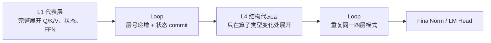
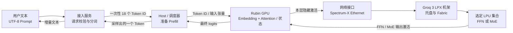
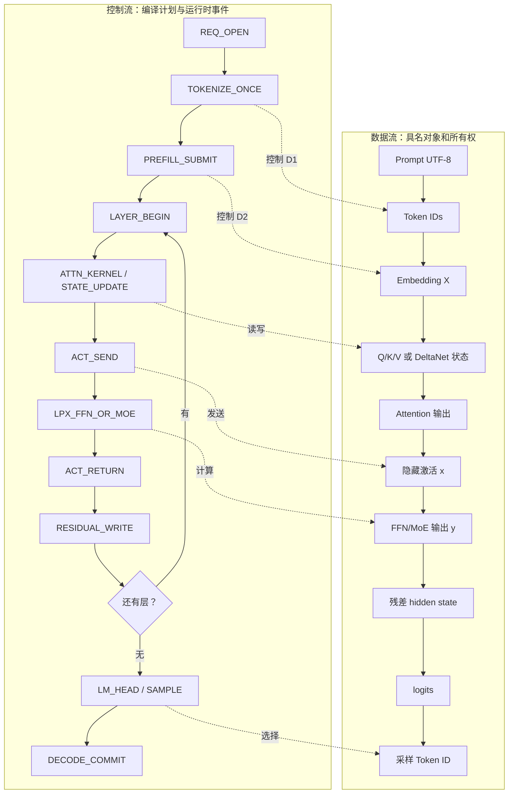
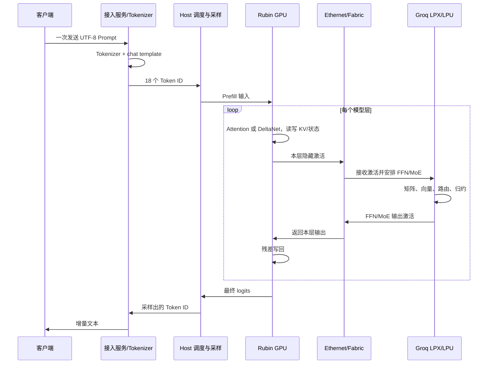
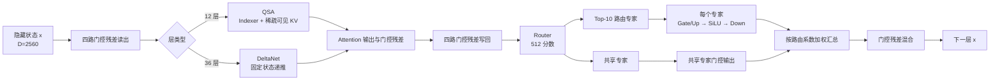
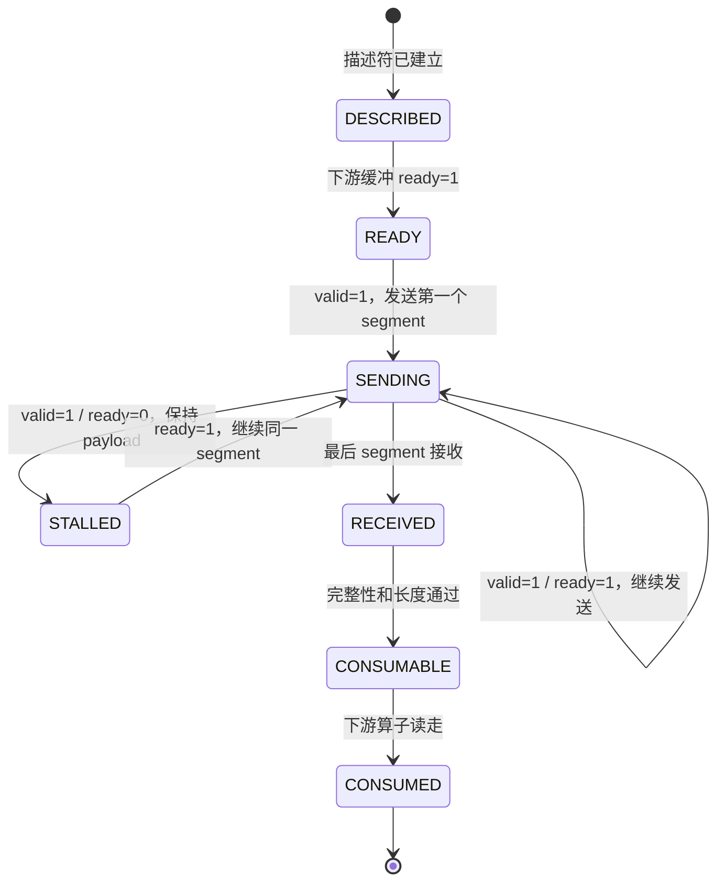
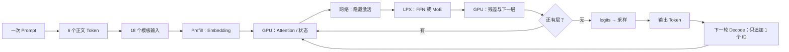

# Groq 3 LPX × Qwen3.8 数据流基线规格

版本：0.1（先审阅数据，再制作交互）  
状态：数据流和硬件职责基线；不是 Groq 或 Qwen 的实机 trace   
固定示例 Prompt：`谁是世界上最厉害的大模型？`

性能与实时计数器口径见[芯片研发性能与数据通路规格](芯片研发性能与数据通路规格.md)；下一版交互的 LPU 聚焦路径见[LPU 核心数据流规格](LPU核心数据流规格.md)。

## 1. 文档用途

这份文档先于交互页面，回答四个问题：

1. 一次请求中的文本、Token、激活、权重、KV 和控制指令分别在哪里产生、在哪里保存、沿什么路径移动。
2. GPU、主机服务、Groq 3 LPX、托盘中的 LPU 和芯片内部功能区各自负责什么。
3. Prefill 与 Decode 的数据生命周期有什么差异；为什么 Decode 不会重新输入原句。
4. 哪些内容来自公开资料，哪些只是为了演示而明确写出的部署假设，哪些目前不能知道。

后续动画只能把本文件中的“可视化动作”做成画面。没有在本文件中出现的硬件位置、封包格式、指令编码、周期数和有效带宽，不得在动画里伪造。

## 2. 证据分层

| 证据层 | 本文采用的内容 | 不允许推出的内容 |
| --- | --- | --- |
| NVIDIA Groq 3 LPX 公开文章和图 | 机架、计算托盘、LPU、Fabric、GPU/LPX 功能关系、公开链路规格 | Qwen 算子已经按本文方式编译；每个算子实际落在哪颗芯片；真实 cycle 和有效吞吐 |
| Hugging Face 固定 revision 的 `config.json` | 层数、隐藏维、头数、KV 头数、FFN/MoE/QSA/PLE 配置、模型 dtype | GPU/LPX 分片、线上传输 dtype、片上地址、真实路由专家 |
| Transformers 固定 revision 的参考实现 | 算子依赖、公式、状态更新顺序、门控和归一化的实现差异 | Groq 编译器指令、生产 kernel、部署后的激活值 |
| 官方 tokenizer 和 Jinja 模板快照 | 本示例的 Token 文本、Token ID、完整输入模板 | 模型真实生成的回答；真实服务是否采用相同模板参数 |
| 本项目明确假设 | B=1、BF16 激活、示例 TP/EP、缩小数值算例、链路序列化下界 | 任何实测延迟、应用有效带宽、真实分片和真实专家编号 |

### 2.1 固定来源

| 资料 | 链接 | 本文用途 |
| --- | --- | --- |
| NVIDIA · Inside NVIDIA Groq 3 LPX | [官方文章](https://developer.nvidia.com/blog/inside-nvidia-groq-3-lpx-the-low-latency-inference-accelerator-for-the-nvidia-vera-rubin-platform/) | 机架、托盘、芯片功能区、AFD 角色分工和链路口径 |
| Qwen3.8-27B | [固定 revision 配置](https://huggingface.co/Qwen/Qwen3.8-27B/blob/1d4bf0f2ff6012fd82039f2fa52739d0dd7c60c0/config.json) | 27B 网络结构 |
| Qwen3.8-Flash-Next | [固定 revision 配置](https://huggingface.co/Qwen/Qwen3.8-Flash-Next/blob/de4b8e4d43b917e7706784d8bb445c9af86a3540/config.json) | Flash-Next 网络结构 |
| Transformers 参考实现 | [qwen3_5](https://github.com/huggingface/transformers/blob/cbc1651a032b923da7f4b44b3d0e6f68e6ba6b55/src/transformers/models/qwen3_5/modeling_qwen3_5.py)、[qwen4_exp](https://github.com/huggingface/transformers/blob/cbc1651a032b923da7f4b44b3d0e6f68e6ba6b55/src/transformers/models/qwen4_exp/modeling_qwen4_exp.py) | 算子顺序和公式参考 |
| Tokenizer 快照 | [27B tokenizer](https://huggingface.co/Qwen/Qwen3.8-27B/tree/1d4bf0f2ff6012fd82039f2fa52739d0dd7c60c0)、[Flash tokenizer](https://huggingface.co/Qwen/Qwen3.8-Flash-Next/tree/de4b8e4d43b917e7706784d8bb445c9af86a3540) | 本示例 Token 和模板 |

## 3. 示例输入和真实 Token

### 3.1 原文只进入一次

原始 Prompt 在服务入口以 UTF-8 文本到达。对本示例，字符数为 13，UTF-8 字节数为 39。这个文本只用于一次分词；进入模型后传输的是 Token ID 和激活，不是反复飞行的文字粒子。

### 3.2 正文 Token

两个固定 revision 的 tokenizer 对本句得到相同的正文 Token。正文 Token 按顺序逐个揭示，后面的 Token 在前一个揭示前不能出现在画面上。

| 顺序 | 字片 | Token ID | 原文范围 | 生命周期 |
| ---: | --- | ---: | --- | --- |
| 1 | `谁是` | 121232 | 字符 0–1 | 分词阶段产生；Prefill 使用 |
| 2 | `世界上最` | 114314 | 字符 2–5 | 分词阶段产生；Prefill 使用 |
| 3 | `厉害` | 102169 | 字符 6–7 | 分词阶段产生；Prefill 使用 |
| 4 | `的大` | 97796 | 字符 8–9 | 分词阶段产生；Prefill 使用 |
| 5 | `模型` | 103725 | 字符 10–11 | 分词阶段产生；Prefill 使用 |
| 6 | `？` | 10992 | 字符 12 | 分词阶段产生；Prefill 使用 |

### 3.3 对话模板 Token

本项目关闭 thinking，并打开 assistant 生成前缀。固定模板产生 18 个输入 Token；其中 6 个是正文，12 个是模板/换行标记。

| 输入位置 | Token ID | 显示文本 | 来源 |
| ---: | ---: | --- | --- |
| 0 | 248045 | `<\|im_start\|>` | 模板 |
| 1 | 846 | `user` | 模板 |
| 2 | 198 | 换行 | 模板 |
| 3 | 121232 | `谁是` | 正文 |
| 4 | 114314 | `世界上最` | 正文 |
| 5 | 102169 | `厉害` | 正文 |
| 6 | 97796 | `的大` | 正文 |
| 7 | 103725 | `模型` | 正文 |
| 8 | 10992 | `？` | 正文 |
| 9 | 248046 | `<\|im_end\|>` | 模板 |
| 10 | 198 | 换行 | 模板 |
| 11 | 248045 | `<\|im_start\|>` | 模板 |
| 12 | 74455 | `assistant` | 模板 |
| 13 | 198 | 换行 | 模板 |
| 14 | 248068 | `<think>` | 模板 |
| 15 | 271 | 两个换行 | 模板 |
| 16 | 248069 | `</think>` | 模板 |
| 17 | 271 | 两个换行 | 模板 |

模板 Token 只在本次请求的 Prefill 进入模型一次。Decode 每轮只追加一个新 Token ID，并复用已存在的 KV/状态。

## 4. 两个模型的结构基线

| 项目 | Qwen/Qwen3.8-27B | Qwen/Qwen3.8-Flash-Next |
| --- | --- | --- |
| 固定 revision | `1d4bf0f2ff6012fd82039f2fa52739d0dd7c60c0` | `de4b8e4d43b917e7706784d8bb445c9af86a3540` |
| 参数口径 | 约 27B BF16 参数 | 语言部分约 180B 权重；模型卡另列约 125B 标称规模、约 6B 激活参数、n-gram 与 MTP 组成 |
| 层数 | 64 | 48 |
| 隐藏维 `D` | 5120 | 2560 |
| 查询头 / KV 头 | 24 / 4 | 24 / 2 |
| 头维 `d` | 256 | 256 |
| 层类型 | 48 个 `linear_attention`（DeltaNet）+ 16 个 `full_attention` | 36 个 `linear_attention`（DeltaNet）+ 12 个 `full_attention`（QSA） |
| FFN | Dense SwiGLU，`F=17408` | 512 个路由专家，`F=640`，每 Token Top-10，另有 1 个共享专家 |
| 额外路径 | `output_gate_type=swish` 配置字段 | 第 2 层 PLE n-gram；四路门控残差；MTP 独立配置 |
| 公开可用的实现 | qwen3_5 参考实现 | qwen4_exp 参考实现 |

“层 0、1、2、3”在本文按配置数组的零基索引理解；展示标签统一使用“第 1 层”这种人类可读的 1 基编号。每隔四层的 full attention 位置由固定配置确认，不把 Q 头、分片或流水段画成额外的物理电路。

### 4.1 交互中的层循环规则

芯片研发工程师需要看到数据依赖，但不需要把同一组算子重复画几十次。因此交互页采用“代表层 + Loop”规则：代表层完整展开指令、输入输出张量、硬件资源和性能计数器；后续同构层只显示循环边界、迭代次数、状态提交和下一层入口。Loop 是软件调度语义，不是额外的硬件模块。

| 模型 | 完整展开的代表层 | Loop 节点 | 说明 |
| --- | --- | --- | --- |
| Qwen3.8-27B | L1 DeltaNet；L4 Gated Attention | L2–L3：DeltaNet ×2；L5–L64：`DeltaNet ×3 → Gated Attention` ×15 | L4 单独保留，因为它改变 Token Mixer；其余层按四层周期复用 |
| Qwen3.8-Flash-Next | L1 DeltaNet；L2 DeltaNet + PLE；L4 QSA | L5–L48：`DeltaNet ×3 → QSA` ×11 | L2 的 PLE 和 L4 的 QSA 都是结构分支，不能并入普通 DeltaNet |



Loop 节点中显示 `for (l=first; l<=last; l++)`、`run(representative)`、`state ← commit(l)` 三类事件。动画不会重新制造相同 Token、权重或粒子；读者仍可从代表层的每笔数据追到下一个 Loop 的状态边界。性能面板将 Loop 的计数作为迭代次数，单层估算与总层数估算分开，避免把演示帧数误认为实机 cycle。

## 5. 端到端总流程

下图描述一条请求的职责边界。箭头表示数据或控制交接；它不表示每一条实际物理线缆，也不表示公开资料已经给出所有内部 DMA 路径。



GPU 和 LPX 的合作关系来自 NVIDIA 公开 AFD 的功能分工方向：GPU 承担 Attention，LPX 承担 FFN/MoE。把 Qwen 的每一层都套用这个方向，是本项目的“AFD 教学部署情景”，不是已公开的 Qwen 生产编译结果。最终输出必须经过 GPU/主机侧的词表头、采样和服务层，不能把 LPX 直接画成把文本发给用户。

## 6. 请求阶段总表

### 6.1 Prefill：一次处理完整上下文

本示例 `B=1`、输入长度 `T=S=18`。Prefill 对 18 个位置同时推进，建立每层的 KV Cache 或 DeltaNet 状态，并在最后得到首个可采样位置的 logits。

| 序号 | 软件动作 / 控制指令（教学名称） | 数据对象 | 从 → 到 | 计算或状态变化 | 完成条件 | 证据口径 |
| ---: | --- | --- | --- | --- | --- | --- |
| P0 | `REQ_OPEN` | 39 B UTF-8 Prompt + 请求元数据 | 用户 → 接入服务 | 校验请求、选择模型、记录一次输入 | 请求合法 | 服务行为；接口字段以官方文档为准 |
| P1 | `TOKENIZE_ONCE` | 6 个正文 ID | 服务内 | tokenizer 按官方结果产生正文 Token | 6 个正文 ID 已按序生成 | 固定 tokenizer 快照 |
| P2 | `APPLY_CHAT_TEMPLATE` | 18 个完整输入 ID | 服务内 | Jinja 模板加入角色、边界和空 thinking 段 | 18 个 ID 已确定 | 固定模板快照 |
| P3 | `PREFILL_SUBMIT` | `[B=1,T=18]` Token ID | Host → GPU | DMA/运行时提交输入；不把文字直接送入 LPX | GPU 接收输入 | 主机/GPU 交接是部署接口；具体 DMA 未公开 |
| P4 | `EMBED_LOOKUP` | `E[id]` | GPU MEM → GPU 执行资源 | 每个 ID 查一行词嵌入，形成 `X∈R^(18×D)` | 当前批次所有位置可读 | 模型结构；实际权重地址未知 |
| P5 | `LAYER_BEGIN(l)` | `X_l`、残差副本 | GPU 控制 → GPU 计算资源 | 进入第 `l` 层；保存残差和本层依赖 | 前一层写回有效 | 软件调度事件 |
| P6 | `ATTN_OR_DELTANET(l)` | Q/K/V、KV 或状态 | GPU 内部 | full attention 做 QK/Softmax/PV；linear attention 更新 DeltaNet 状态 | 本层 Token Mixer 输出有效 | 算法由配置和参考实现确定 |
| P7 | `ACT_SEND(l)` | 本层隐藏激活 `[18,D]` | GPU → Ethernet → LPX | 按教学部署情景发送 FFN 输入；不是发送原文或所有权重 | LPX 接收缓冲 ready | AFD 角色分工 + 项目假设 |
| P8 | `LPX_FFN_OR_MOE(l)` | 激活、分片权重、路由分数 | LPX Fabric → LPU/MXM/VXM | 27B 做 Dense SwiGLU；Flash 做 Router/专家/共享专家 | 输出激活或部分和有效 | 模型公式确定；LPU 放置是情景假设 |
| P9 | `ACT_RETURN(l)` | FFN/MoE 输出 `[18,D]` | LPX → Ethernet → GPU | 根片完成归约/加权后返回 | GPU 接收完整输出 | AFD 角色分工 + 项目假设 |
| P10 | `RESIDUAL_WRITE(l)` | Attention 输出 + FFN 输出 | GPU VXM/MEM | 完成残差、Norm、下一层输入 | `X_(l+1)` 有效 | 参考实现依赖 |
| P11 | `FINAL_NORM` | 最后一层隐藏状态 | GPU | 最终 RMSNorm | 词表头输入有效 | 模型结构；实际 owner 未公开 |
| P12 | `LM_HEAD` | logits `[B,T,V]` | GPU / 运行时 | 词表投影，选取生成位置的 logits | 生成位置 logits 有效 | 算法步骤；实际分片未公开 |
| P13 | `SAMPLE` | logits + 采样参数 | GPU/Host → 服务 | 选择一个输出 Token ID | 一个 ID 被确认 | 服务策略可能不同 |
| P14 | `DETOKENIZE` | 输出 Token ID | 服务 | 反分词为文本片段 | 文本增量可发送 | tokenizer 行为 |
| P15 | `PREFILL_DONE` | 首个输出 Token | 服务 → 用户 | 发送首个流式片段，保留 KV/状态 | 客户端收到片段 | 产品接口行为 |

### 6.2 Decode：每轮只处理一个新 Token

Decode 的本轮输入 `T=1`。如果此前已有 `S-1` 个位置，则本轮把上下文长度变成 `S`，读取历史 KV/状态，只追加当前位置；它不会重新接收原始 Prompt，也不会再次运行 P1–P4。

| 序号 | 软件动作 / 控制指令（教学名称） | 数据对象 | 从 → 到 | 计算或状态变化 | 完成条件 |
| ---: | --- | --- | --- | --- | --- |
| D0 | `NEXT_TOKEN_ID` | 上一轮采样出的 1 个 ID | 服务 → Host | 把上一轮输出作为本轮输入 | ID 可读 |
| D1 | `DECODE_SUBMIT` | `[1,1]` Token ID | Host → GPU | 提交一个新位置；复用模型副本 | GPU 接收 ID |
| D2 | `EMBED_LOOKUP` | 新 Token 的 embedding 行 | GPU MEM → GPU | 只查当前 ID | 当前向量有效 |
| D3 | `LAYER_BEGIN(l)` | 当前 `x_l`、历史状态 | GPU 控制 → GPU | 读取本层保留的 KV/DeltaNet 状态 | 历史状态 ready |
| D4 | `ATTN_OR_DELTANET(l)` | 当前 Q/K/V + 历史 KV/状态 | GPU 内部 | QK 只访问可见历史；追加一个 KV 或递推一次状态 | 本层 Attention 输出有效 |
| D5 | `ACT_SEND(l)` | `[1,D]` 激活 | GPU → LPX | 当前层一条激活交给 LPX FFN/MoE | LPX `ready=1` |
| D6 | `LPX_FFN_OR_MOE(l)` | 当前激活 + 局部权重 | LPX 内部 | 计算、分片归约或专家加权汇总 | 完整 FFN/MoE 输出有效 |
| D7 | `ACT_RETURN(l)` | `[1,D]` 输出激活 | LPX → GPU | 返回当前层结果 | GPU 接收完成 |
| D8 | `RESIDUAL_WRITE(l)` | 残差和 | GPU | 写回下一层输入 | `l+1` 可开始 |
| D9 | `LOGITS_SAMPLE` | 最后位置 logits | GPU → Host/服务 | 词表头、采样、反分词 | 一个输出 ID/文本片段有效 |
| D10 | `DECODE_COMMIT` | 新 KV/状态 + 输出 ID | GPU/服务 | 提交缓存和下轮输入 | 本轮结束；等待下一轮 |

如果用户继续请求，流程从 D0 开始；如果用户停止，缓存可以释放。动画应显示一次输入、一次分词、多轮 Decode 的闭环，而不是让同一串正文 Token 无限从画面左侧重新进入。

## 7. 软件控制流和数据流分离

软件指令决定“何时读、算、写、同步”；数据对象决定“读的是什么、形状多大、归谁所有”。二者在实现中同时存在，但不应画成同一种粒子。



### 7.1 教学控制事件字典

下面名称是动画和文档使用的教学事件名，不是 Groq 未公开的 ISA 名称。每个事件必须有读集合、写集合、执行资源和前置条件。

| 事件 | 读取对象 | 写入对象 | 资源归属 | 前置条件 |
| --- | --- | --- | --- | --- |
| `EMBED_LOOKUP` | `token_id`、Embedding 权重 | `x_embed` | GPU MEM / 向量单元 | Token ID 有效 |
| `RMSNORM` | `x`、`gamma` | `x_norm`、归约临时值 | GPU VPU / Reduction | 输入向量完整 |
| `QKV_PROJ` | `x_norm`、`Wq/Wk/Wv` | `Q/K/V` | GPU Matrix/Tensor 单元 | 权重 ready |
| `ROPE` | `Q/K`、位置索引 | `Q_rot/K_rot` | GPU Vector 单元 | 位置和头布局 ready |
| `QK_SCORE` | `Q_rot/K_rot` | `scores` | GPU Matrix/Tensor 单元 | 可见 KV ready |
| `SOFTMAX` | `scores` | `prob` | GPU Reduction/Vector | 行最大值和分母完成 |
| `PV` | `prob/V` | `attn_out` | GPU Matrix/Tensor 单元 | 概率有效 |
| `STATE_UPDATE` | `q/k/v`、旧状态 | 新 DeltaNet 状态、输出 | GPU Vector/Reduction | 旧状态 ready |
| `ACT_SEND` | `x` | LPX 接收缓冲 | GPU NIC / 网络 | 接收端 `ready=1` |
| `ROUTER_TOPK` | `x`、Router 权重 | 512 分数、Top-10 索引 | LPX Matrix + Vector | 激活已到根片 |
| `FFN_GATE_UP` | `x`、Gate/Up 权重 | `g/u` | LPX MXM | 权重和输入 ready |
| `SILU_MUL` | `g/u` | `h` | LPX VXM | `g/u` 完整 |
| `FFN_DOWN` | `h`、Down 权重 | `y_partial` 或 `y_e` | LPX MXM | 中间激活 ready |
| `REDUCE_OR_MIX` | 部分和或专家输出、路由权重 | 完整 `y` | LPX VXM / C2C | 所有必需输入已接收 |
| `ACT_RETURN` | `y` | GPU 接收缓冲 | LPX NIC / 网络 | GPU `ready=1` |
| `RESIDUAL_WRITE` | Attention 输出、FFN 输出、残差 | 下一层 `x` | GPU Vector/MEM | 两路输出都 valid |
| `LM_HEAD` | 最终 hidden、词表权重 | logits | GPU Matrix | 最终 Norm 完成 |
| `SAMPLE` | logits、采样参数 | 新 Token ID | Host/服务 | logits valid |

## 8. 数据对象账本

| 对象 | 产生位置 | 典型形状（本示例） | 精度口径 | 保存多久 | 是否跨 GPU/LPX |
| --- | --- | --- | --- | --- | --- |
| `prompt_utf8` | 用户/服务 | 39 B | UTF-8 | 分词完成后可释放 | 否 |
| `token_id` | tokenizer | `[18]`（含模板） | ID；教学账本按 4 B 计 | Prefill 提交后可由服务保留 | Host → GPU 一次 |
| `x_embed` | GPU Embedding | `[18,D]` 或 `[1,D]` | 模型配置 BF16 | 当前层计算期间 | GPU 内 |
| `Q/K/V` | GPU 投影 | full attention：`Q[T,24,256]`、`K/V[T,KV,256]`；DeltaNet：`Q/K[ T,16,128]`、`V[T,48,128]` | 以参考实现为算法口径；生产 dtype 未公开 | 当前层 | GPU 内 |
| `kv_cache` | GPU full attention | `[S,KV,256]` 每层 | 模型配置 BF16 是权重/激活口径；线上压缩未公开 | 整个请求 Decode | GPU 内 |
| `delta_state` | GPU linear attention | `[48,128,128]` 的 V 头状态（示例形状） | 参考实现为 FP32 状态 | 整个请求 Decode | GPU 内 |
| `activation_x` | GPU Attention 后 | `[T,D]` | 教学情景按 BF16 | 当前层往返 | GPU → LPX |
| `router_scores` | LPX Router | `[1,512]` | 配置未指定线上 dtype；数值算例可用 FP32 | 当前 Token/层 | LPX 内 |
| `expert_input` | LPX 路由 | Top-10 对应的若干 `[1,D]` | 教学情景按 BF16 | 当前 Token/层 | 可能经 C2C |
| `y_partial` | LPX Dense TP | `[1,D]` | 归约暂按 FP32 展示 | 归约完成前 | LPU → 根片 |
| `expert_output` | LPX MoE | 每个命中专家 `[1,D]` | 教学情景按 BF16 | 加权汇总前 | 可能经 C2C |
| `activation_y` | LPX 汇总后 | `[T,D]` | 教学情景按 BF16 | 返回 GPU 后参与残差 | LPX → GPU |
| `logits` | GPU 词表头 | `[1,V]` | 实际分片/精度未公开 | 采样完成后可释放 | GPU → Host |
| `sampled_id` | Host/服务 | `[1]` | ID | 作为下一 Decode 输入 | Host → GPU |

## 9. 算子和硬件职责

### 9.1 GPU 侧：Attention 和状态

| 模型分支 | 算子顺序 | 输入/输出 | GPU 资源类别 | 必须保留的状态 |
| --- | --- | --- | --- | --- |
| 27B DeltaNet 层 | RMSNorm → Q/K/V/门控投影 → 深度因果卷积 → Q/K 归一化 → 状态递推 → 输出门控 → 输出投影 → 残差 | `x[D]` → `o[D]` | Matrix/Tensor、Vector、Reduction、MEM | 每层 DeltaNet 状态和残差 |
| 27B full attention 层 | RMSNorm → Q/K/V → QK Norm/部分 RoPE → KV 追加 → QKᵀ → 因果 Softmax → PV → 门控/输出投影 → 残差 | `x[D]`、历史 KV → `o[D]` | Matrix/Tensor、Vector、Reduction、MEM | 每层 KV Cache |
| Flash DeltaNet 层 | 四路门控残差读出 → DeltaNet 路径 → 四路门控写回 | `[D]` 与四路残差 | GPU Vector/Matrix | DeltaNet 状态、四路残差 |
| Flash QSA 层 | Indexer Q/K → 四 Token 微块选择 → 主 Q/K/V → QK/掩码 Softmax/PV → 门控残差写回 | 当前向量 + 稀疏可见 KV → `o[D]` | GPU Matrix、Vector、Reduction、MEM | KV Cache、Indexer 选择结果 |

### 9.2 LPX 侧：FFN、MoE 和片间归约

| 模型 | LPX 计算 | 片间数据 | 归约规则 | 注意事项 |
| --- | --- | --- | --- | --- |
| 27B Dense SwiGLU | `g=xW_gate`；`u=xW_up`；`h=SiLU(g)⊙u`；`y=hW_down` | TP2 教学分片：两片接收相同 `x`，各自持有不同中间通道 | `y=y_0+y_1`，教学上以 FP32 部分和展示，再转回激活口径 | Token 不拆半；拆的是 FFN 中间通道 |
| Flash-Next MoE | `scores=xW_router`；Top-10；各专家 Gate/Up/SiLU/Down；共享专家独立门控 | EP8/EP16 只是容量示例；激活发往命中专家所在 LPU | `y=Σ p_e y_e + y_shared`；Top-10 后是否重归一化以固定参考实现为准 | 示例专家编号不是本句真实路由结果 |

### 9.3 片上功能区映射

| 软件对象或算子 | 芯片功能区 | 映射理由 | 可公开确认的范围 |
| --- | --- | --- | --- |
| 权重、KV、DeltaNet 状态、接收缓冲 | MEM / SRAM | 需要持久保存和供计算读取 | 资源类别可解释；真实 bank/地址未公开 |
| 矩阵投影、QK、PV、Gate/Up/Down | MXM / Matrix Array | 大量乘加 | 功能类型；实际指令和阵列尺寸未公开 |
| RMSNorm、RoPE、SiLU、门控、Top-K、格式转换 | VXM / Vector Unit | 逐元素、归约或选择 | 功能类型；具体流水线未公开 |
| 数据搬移、转置、布局重排 | SXM/LSU/DMA/Shuffle | 服务于矩阵和头布局 | 不把软件“分片”画成额外硬件 |
| 依赖、循环、同步、valid/ready | ICU/Scheduler/Scoreboard | 保证前后序和背压 | 仅作控制语义展示，不声称 ISA 字段 |
| 托盘内跨芯片通信 | C2C spine / Fabric | 把激活或部分和送到目标 LPU | 链路功能公开；内部路由和封包未知 |

## 10. GPU、LPX、主机之间的真实职责边界



职责边界要保持以下顺序：

- **服务/Host**：请求校验、一次性分词、模板、模型副本选择、运行时调度、采样、反分词和用户 I/O。
- **Rubin GPU**：按公开 AFD 方向承载 Attention；在本项目中保留 KV/DeltaNet 状态，并把中间激活交给 LPX。
- **LPX**：接收激活，依据当前层的 Dense FFN 或 MoE 计划执行矩阵、向量、路由和归约，再返回隐藏激活。
- **LPU 芯片**：是 LPX 中的计算资源。LPU 产生的是激活或部分和，不直接产生最终用户文本。
- **GPU/Host 返回路径**：最终词表投影和采样完成后，Token ID 才能经服务层变成用户可见文本。

## 11. Prefill 与 Decode 的形状和算量口径

设批量 `B=1`，本轮位置数 `T`，有效上下文长度 `S`，隐藏维 `D`，查询头数 `H`，KV 头数 `G`，头维 `d`，FFN 中间维 `F`，词表大小 `V`。

| 量 | Prefill | Decode |
| --- | --- | --- |
| 本轮位置数 | `T=S`，本示例为 18 | `T=1` |
| 历史长度 | 0（本轮建立） | `S-1`，来自已有 KV/状态 |
| KV 写入 | 每层追加本轮全部位置 | 每层只追加 1 个位置 |
| Attention 分数规模 | 逻辑上 `[B,H,S,S]`，因果掩码后有效对为 `S(S+1)/2` | `[B,H,1,S]` |
| Embedding 查表 | 18 行 | 1 行 |
| 原始 Prompt/模板 | 只出现一次 | 不重复 |
| 输出节奏 | 完成整段后得到首个 Token | 每轮得到一个 Token |

### 11.1 激活和链路字节（明确的教学假设）

以下只计算裸数据下界，不代表真实网络流量。设 BF16 为 2 B，Token ID 教学账本按 4 B，FP32 部分和按 4 B。

| 模型 | `D` | 单位置 BF16 激活 | Prefill 18 位置激活 | Decode 单 Token 激活 |
| --- | ---: | ---: | ---: | ---: |
| Qwen3.8-27B | 5120 | 10240 B | 184320 B | 10240 B |
| Flash-Next | 2560 | 5120 B | 92160 B | 5120 B |

LPX 文章公开的 400 Gb/s Ethernet 和 112 Gb/s C2C 是物理链路标称值。换算为 50 GB/s 和 14 GB/s 后，可以写出单条链路的序列化下界：

```text
裸序列化时间 = 有效负载字节数 / 链路字节每秒
```

协议头、编码、拥塞、排队、背压、Fabric 路由、芯片计算和软件调度都没有被这个式子覆盖。页面应把这类数值标成“链路序列化下界”，不能标成应用 latency 或真实 cycle。

### 11.2 可复算的权重规模

| 项目 | 公式 | 参数量 | BF16 字节 |
| --- | --- | ---: | ---: |
| 27B 单层 Dense SwiGLU | `3 × D × F = 3 × 5120 × 17408` | 267386880 | 534773760 B |
| 27B 单片 TP2 的单层中间通道 | `3 × D × (F/2)` | 133693440 | 267386880 B |
| Flash 单个专家 | `3 × 2560 × 640` | 4915200 | 9830400 B |
| Flash Router 矩阵 | `2560 × 512` | 1310720 | dtype 未由配置确定 |

27B 单层完整 FFN 的 BF16 权重已经超过公开的单片 SRAM 容量口径，不能画成“整层权重每次都在一片 SRAM 中完整展开”。Flash-Next 的 512 个专家也不能因为一个 Token 只激活 Top-10，就把其余权重从物理存储中删除；Top-10 只表示当前 Token 的计算参与者。

## 12. 两模型的详细算子链

### 12.1 Qwen3.8-27B

```mermaid
flowchart LR
  X[隐藏状态 x<br/>D=5120] --> N[RMSNorm]
  N --> T{层类型}
  T -->|48 层| DL[DeltaNet<br/>Q/K/V + 状态递推]
  T -->|16 层| FA[Full Attention<br/>QK → Softmax → PV]
  DL --> A[Attention 输出投影]
  FA --> A
  A --> R1[残差相加]
  R1 --> F1[RMSNorm]
  F1 --> GU[Gate / Up<br/>D → F=17408]
  GU --> S[SiLU(g) ⊙ u]
  S --> DN[Down<br/>F → D]
  DN --> R2[残差相加]
  R2 --> XN[下一层 x]
```

关键数据依赖：

- DeltaNet 层不是历史 Token × Token 的 Softmax；它读取上一时刻的固定状态，按参考实现递推后写回状态。
- Full Attention 层把新 K/V 追加到本层 KV Cache；Decode 的 Q 读取历史可见位置。
- Dense FFN 的 TP2 教学分片沿中间维 `F` 切分。两片接收相同的 `x`，每片产生完整 D 维的部分和，根片再做无权相加。
- `output_gate_type=swish` 是配置字段；固定参考实现的 Attention.forward 使用 sigmoid gate。文档和动画必须同时标出这个来源差异，不能擅自选择一边并称为已验证硬件行为。

### 12.2 Qwen3.8-Flash-Next



关键数据依赖：

- 第 2 层才注入 PLE n-gram 路径；`ngram_size=3`、`heads_per_ngram=8`、`split_ngram_parts=128` 是配置事实。PLE 不是另一套普通词嵌入，也不是另一颗芯片。
- QSA 的 Indexer 使用 4 个查询头、1 个 KV 头、头维 128；主 Attention 仍是 24 个查询头和 2 个 KV 头。二者不能合并成一个“Q 头”图例。
- QSA 以 4 Token 为一个微块，预算 2048 Token，最多选择 512 个完整微块并加上可见尾部。选择结果是软件/算法状态，不是硬件中固定存在的 512 个模块。
- Router 产生 512 个专家分数，Top-10 是当前 Token 的路由结果；本项目可以用固定专家编号演示通信路径，但不能声称这些编号来自本句真实推理。
- 参考实现对 Top-10 概率执行再归一化，并用独立门控加入共享专家；合并系数要与原始 Router softmax 概率区分。

## 13. LPX 内部数据路径

### 13.1 27B Dense TP2

```mermaid
flowchart LR
  G[GPU 输出 x<br/>[1,5120]] --> B{复制到两片}
  B --> C0[LPX 根片<br/>通道 0–8703]
  B --> C1[LPX 对等片<br/>通道 8704–17407]
  C0 --> M0[MXM Gate/Up]
  C1 --> M1[MXM Gate/Up]
  M0 --> V0[VXM SiLU/门控]
  M1 --> V1[VXM SiLU/门控]
  V0 --> D0[MXM Down<br/>y0_partial]
  V1 --> D1[MXM Down<br/>y1_partial]
  D1 -->|C2C 部分和| C0
  D0 --> SUM[VXM 求和<br/>y=y0+y1]
  C0 --> SUM
  SUM --> OUT[BF16 FFN 输出<br/>[1,5120]]
  OUT --> G2[返回 GPU]
```

这里“复制到两片”是输入激活的广播；“通道 0–8703 / 8704–17407”是中间维分片。不能把一个 Token 切成两个半 Token，也不能把两片的部分和画成两个输出 Token。

### 13.2 Flash-Next EP

```mermaid
flowchart LR
  G[GPU 输出 x<br/>[1,2560]] --> ROOT[根片 Router<br/>[1,512] 分数]
  ROOT --> TOP[Top-10 索引与系数]
  TOP --> R0[命中专家所在 LPU]
  TOP --> R1[命中专家所在 LPU]
  TOP --> RN[其他命中专家]
  R0 --> E0[专家 Gate/Up → SiLU → Down]
  R1 --> E1[专家 Gate/Up → SiLU → Down]
  RN --> EN[专家 Gate/Up → SiLU → Down]
  E0 --> MIX[根片加权汇总]
  E1 --> MIX
  EN --> MIX
  SH[共享专家门控路径] --> MIX
  MIX --> OUT[MoE 输出激活<br/>[1,2560]]
  OUT --> G2[返回 GPU]
```

同一托盘内的专家可以省去外部 C2C，但是否同片、是否跨托盘由实际部署决定。EP8/EP16 是用于展示容量和路径的示例，必须在界面上标注“假设”。

## 14. 机架、托盘、芯片三层交接

| 观察层级 | 真实对象 | 数据进入点 | 数据离开点 | 交互应该显示什么 | 不应该显示什么 |
| --- | --- | --- | --- | --- | --- |
| 外部服务 | 用户终端、接入服务、Host、Rubin GPU、网络 | 用户 Prompt、Token ID、GPU 激活 | GPU 激活、logits、输出 Token | 一次输入、一次分词、GPU/LPX 往返 | 原文直接穿过 MXM；GPU 直接吐出用户文本 |
| LPX 机架 | 32 个 1U 计算托盘的机架级集合 | Ethernet 上行激活 | 指定托盘的网络流量 | 路由到槽位，标出“机架尺度” | 把机架外观当作芯片内部结构 |
| 1U 计算托盘 | Host CPU、Fabric、NIC/DPU、8 颗 LPU、C2C spine | 前面板 Ethernet、托盘级 C2C | LPU 根片/对等片、返回网络 | NIC → Fabric → LPU 的功能关系 | 猜测未公开的 DMA 引脚和内部拓扑 |
| LPU 芯片 | MEM、SXM/LSU、MXM、VXM、ICU/SYNC、C2C | 激活、权重、KV/状态、控制事件 | 计算结果、部分和、发送缓冲 | 固定硬件实体上高亮具名对象 | 把 Q 头、段、分片画成独立裸片 |

### 14.1 “段”“分片”“Q 头”的软件含义

| 名称 | 这里的含义 | 是否物理单元 | 动画表示 |
| --- | --- | --- | --- |
| 段（segment） | 一次传输被拆成的连续 payload 区间，用于接收缓冲、背压和重组 | 否 | 同一条链路上的连续块，带序号和 valid/ready |
| 分片（shard） | 权重或张量维度的逻辑切分，例如 27B FFN 的中间通道 TP2 | 否；可能映射到一颗或多颗 LPU | 在数据对象上显示范围，例如 `F[0:8704]` |
| Q 头 | Attention 中 Q 的 head 维度和头编号 | 否；不是额外的 Q 芯片 | 显示为张量轴 `[H,d]`，并标注与 KV 头的 GQA 映射 |
| 副本（replica） | 同一模型权重的独立服务实例 | 不是单个算子 | 在调度层显示请求绑定的模型副本 |
| Expert ID | MoE Router 对当前 Token 选中的逻辑专家编号 | 否；不等于固定芯片编号 | 只在 Router 结果确定后显示，并标注是否为示例 |

## 15. 传输协议的教学状态机

动画可以解释“为什么下一步还不能算”，但不能声称复现公开资料未给出的协议字段。建议所有跨设备传输都使用同一状态机：



### 15.1 传输账本字段

| 字段 | 说明 | 是否能填真实值 |
| --- | --- | --- |
| `flow_id` | 当前层、当前 Token、当前方向的逻辑编号 | 可以（项目编号） |
| `src` / `dst` | 逻辑端点，例如 `GPU`、`LPX_ROOT`、`LPU_3` | 可以；物理端点需注明假设 |
| `payload_shape` | 数据张量形状 | 可以按模型配置/情景填 |
| `payload_dtype` | 数据精度 | BF16 是本项目教学假设；线上值未知 |
| `payload_bytes` | 裸 payload 字节数 | 可以按假设计算；不等于线上字节 |
| `segment_bytes` | 教学分段大小 | 项目可设定；不是公开协议事实 |
| `valid` / `ready` | 发送端/接收端逻辑握手 | 可以演示逻辑依赖 |
| `wire_time` | 按标称带宽计算的裸序列化下界 | 可以计算；不能称实测 latency |
| `compute_time` | 矩阵/向量真实耗时 | 未公开，保持未知 |
| `cycle` | 芯片实际时钟周期 | 未公开，不能用动画帧替代 |

## 16. 性能和延迟记录规则

右侧性能面板应该同时显示“可计算量”和“未知量”，而不是给每个动作填一个看似精确的数字。

| 指标 | 计算方法 | 显示标签 |
| --- | --- | --- |
| Prompt UTF-8 字节 | `TextEncoder(Prompt).length` | 输入文本字节；不含 HTTP/TLS |
| Token ID 账本 | `Token 数 × 4 B` | 教学 ID 账本；不代表线上封包 |
| BF16 激活 | `元素数 × 2 B` | 教学激活占用；线上 dtype 未公开 |
| FP32 部分和 | `元素数 × 4 B` | 归约教学口径 |
| 矩阵 FLOPs | 乘加按 `2 × M × K × N` | 算法算量；不等于执行时间 |
| Ethernet 下界 | `payload / (400 Gb/s ÷ 8)` | 单端口裸序列化下界 |
| C2C 下界 | `payload / (112 Gb/s ÷ 8)` | 单链路裸序列化下界 |
| 实机 latency | 需要硬件 trace 或厂商测量 | 未公开 |
| 实机 cycle | 需要频率、指令、流水和 stall trace | 未公开 |
| 有效吞吐 | 需要协议、拥塞、重叠和调度数据 | 未公开 |

## 17. 动画实施前的正确性闸门

只有下列检查全部满足，才把本规格转成交互动作：

| 检查项 | 通过条件 |
| --- | --- |
| Token 一致性 | 正文 6 个 ID、模板 18 个 ID、两个模型固定 revision 一致 |
| 输入次数 | Prompt 和模板只进入一次；Decode 只追加新 ID |
| Prefill/Decode | Prefill 为 `T=S`；Decode 为 `T=1` 且读取历史 KV/状态 |
| 模型分支 | 27B 的 48/16 层、Flash 的 36/12 层和第 2 层 PLE 均按配置出现 |
| GQA | 27B 为 24Q/4KV，Flash 为 24Q/2KV；QSA Indexer 单独标识 4Q/1KV |
| Dense TP | 拆中间维；两片输入相同；输出是部分和归约，不是两个 Token |
| MoE EP | Router 先产生分数再 Top-10；共享专家独立门控；示例专家不冒充真实路由 |
| 硬件职责 | GPU/LPX 只显示公开 AFD 方向和明确假设；LPX 不直接输出用户文本 |
| 数据对象 | 每个动作能指出读对象、写对象、所有权和完成条件 |
| 传输状态 | valid/ready 背压会保持 payload；接收完整后下游才可消费 |
| 性能口径 | 物理标称、裸序列化下界、算法算量、实机 latency/cycle 分开显示 |
| 公开/未知 | 所有未公开的地址、封包、ISA、cycle、有效带宽保持“未知” |

## 18. 交互页面改造约束

后续交互页面应从本文件生成或读取以下数据，而不是在 UI 代码里临时拼接解释：

1. **事件表**：每个 Prefill/Decode 事件的 `id、phase、layer、reads、writes、owner、depends_on、assumption`。
2. **数据表**：每个具名数据对象的 `shape、dtype、bytes、lifetime、src、dst`。
3. **硬件表**：机架、托盘、LPU、MEM/MXM/VXM/ICU/C2C 的层级和固定坐标。
4. **证据表**：事实来源、固定 revision、项目假设、未知项和显示标签。
5. **动画规则**：一个事件只改变它声明的状态；数据沿真实的逻辑路径移动；没有依赖的对象不提前出现。

推荐的逐步阅读顺序是：



当前阶段只完成这份数据流基线；交互页面的布局、3D 镜头和动画时序应在这份文档评审通过后再继续修改。
