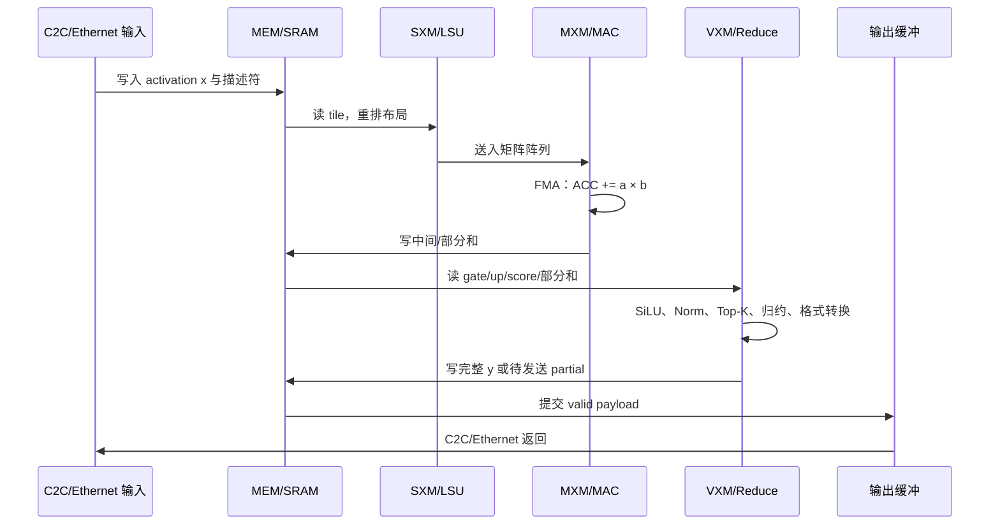
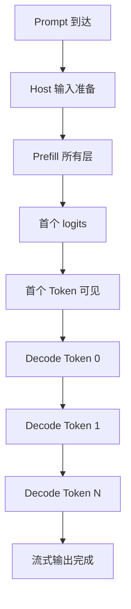
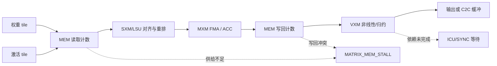
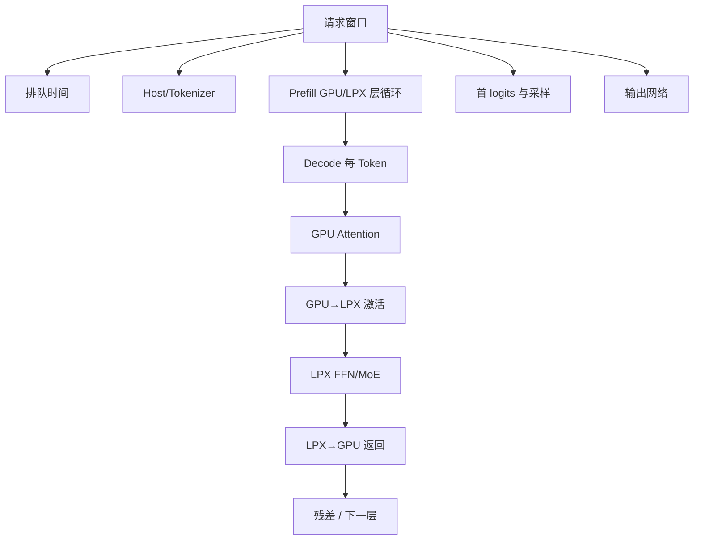

# 面向芯片研发工程师的性能与数据通路规格

版本：0.1  
状态：工程口径设计；用于审阅数据和性能计算，不代表已取得 Groq/NVIDIA 实机 trace  
关联基线：[数据流基线规格](数据流基线规格.md)

## 1. 目标和边界

研发工程师需要看到的不是“一个 Token 在画面里飞过去”，而是每一次读写、搬运、乘加、归约、等待和提交：

- 数据对象有名字、形状、精度、字节数、产生者、消费者和生命周期。
- 每个对象经过明确的硬件资源：主机缓冲、DMA、GPU 计算资源、网络接口、LPX Fabric、片上 MEM、MXM、VXM、SXM、ICU/SYNC、C2C。
- 延迟由阶段开始/结束时间或硬件周期计算，不用动画帧代替 cycle。
- 带宽、内存利用率、矩阵/向量单元利用率、链路利用率和 AI 推理性能分别计算，不把一个百分比复用到所有指标。
- 公开标称值、理论下界、项目部署假设和真实实测值必须有不同标签。

本规格覆盖固定示例 Prompt `谁是世界上最厉害的大模型？`、Qwen3.8-27B 和 Qwen3.8-Flash-Next。模型结构、Token 和数据流以[数据流基线规格](数据流基线规格.md)为准；本文件补充硬件级账本、性能公式和实时 trace 接口。

## 2. 四种数字必须分开

| 数字类型 | 含义 | 例子 | 能否直接作为实时性能 |
| --- | --- | --- | --- |
| 公开标称峰值 | 厂商公布的硬件上限或链路速率 | 400 Gb/s Ethernet、112 Gb/s C2C、片上 SRAM 带宽口径、FP8 峰值 | 不能；它只是分母 |
| 理想资源下界 | `工作量 / 峰值`，假设没有排队、冲突、stall 和协议开销 | 矩阵 FLOPs ÷ 峰值 FLOP/s | 不能；只能作 roofline 下界 |
| 运行时估算 | 使用明确设置的精度、分片、权重读取次数和利用率假设 | `max(T_math,T_mem,T_link)+固定开销` | 只能称估算 |
| 实时实测 | 从设备/模拟器 trace 读取时间戳、字节计数、活动周期和 stall | `bytes/(t_end-t_start)` | 可以；必须注明 trace 来源 |

如果没有硬件 trace，右侧性能面板的“实时”只能表示**当前事件实时重算的估算值**，不能称为芯片实时测量。

### 2.1 代表层与 Loop 的计数口径

同构层只在代表层计算一次详细的算子、读写字节和资源利用率；后续层用 Loop 记录迭代次数。对单层估算，使用代表层的 `T_layer`、`B_read_layer`、`F_layer`；对模型路径，再使用 `N_loop` 做软件层数累计：

`T_group = T_rep + N_loop × T_rep`，`F_group = F_rep × (1 + N_loop)`，`B_group = B_rep × (1 + N_loop)`。

这只是把同构层的账目展开，不能把它当作并行硬件的实测总延迟。结构变化的层单独建立代表层（27B 的 L4 full attention；Flash-Next 的 L2 PLE、L4 QSA），不强行套用普通 DeltaNet 的公式。Loop 的实时计数器显示 `first_layer / last_layer / iteration / state_commit`，动画只执行一次代表层数据依赖。

## 3. 端到端硬件路径

```mermaid
flowchart LR
  U[用户终端<br/>UTF-8 Prompt] --> NIC0[服务网卡 / 接入层]
  NIC0 --> HBUF[Host DRAM<br/>请求与 Token ID]
  HBUF --> CPU[Host CPU<br/>Tokenizer / 调度 / 采样]
  CPU --> DMA0[PCIe / DMA 描述符]
  DMA0 --> GIN[GPU 输入缓冲]
  GIN --> GEMB[GPU Embedding / Vector]
  GEMB --> GATTN[GPU Matrix + Vector<br/>Attention / DeltaNet]
  GATTN --> GBUF[GPU 激活发送缓冲]
  GBUF --> ENET[GPU NIC / Spectrum-X<br/>400 Gb/s 标称]
  ENET --> RACK[Groq 3 LPX<br/>机架 / 托盘 / Fabric]
  RACK --> RX[LPX NIC / 接收缓冲]
  RX --> LMEM[LPX MEM / SRAM]
  LMEM --> MXM[MXM<br/>矩阵乘加]
  MXM --> VXM[VXM<br/>SiLU / Norm / Reduce]
  VXM --> C2C[C2C spine<br/>112 Gb/s 标称]
  C2C --> LMEM
  VXM --> LOUT[LPX 输出缓冲]
  LOUT --> ENET2[Ethernet 返回]
  ENET2 --> GBUF2[GPU 接收缓冲]
  GBUF2 --> GRES[GPU 残差 / 下一层]
  GRES --> GATTN
  GRES --> HEAD[GPU/运行时词表头]
  HEAD --> CPU
  CPU --> NIC0
  NIC0 --> U
```



### 3.1 责任边界

| 位置 | 负责的工作 | 输入 | 输出 | 本规格可确认的范围 |
| --- | --- | --- | --- | --- |
| 服务网卡/Host | 接收请求、分词、模板、调度、采样、反分词 | UTF-8 文本、配置、采样参数 | Token ID、采样 Token、文本 | 软件流程可以定义；服务器型号和实际 DMA 未公开 |
| Rubin GPU | Embedding、Attention/DeltaNet、KV/状态、残差和词表头（AFD 教学部署） | Token ID、历史 KV/状态、LPX 返回激活 | Attention 激活、最终 logits | NVIDIA 公开 AFD 给出功能分工方向；Qwen 实际部署仍需编译验证 |
| LPX 网络/Fabric | 把 GPU 激活交给目标托盘/LPU，收回 FFN/MoE 输出 | 隐藏激活、路由/分片元数据 | LPU 输入/输出激活 | 链路和功能关系公开；具体包格式、路由表和 DMA 未公开 |
| LPX LPU | FFN/MoE 矩阵、向量、路由、部分和/加权汇总 | 激活、常驻权重、控制计划 | 完整 FFN/MoE 激活 | 功能区类别可解释；真实阵列规格和 ISA 未公开 |
| 用户侧 | 接收流式文本 | 输出 Token/片段 | 可见文本 | 不能把 LPX 直接画成文本发生器 |

## 4. 一条 Decode Token 的逐事件通路

下面以 `B=1、T=1、D=5120` 的 27B Decode 为例。Flash-Next 只替换维度、层分支和 FFN/MoE 路径。事件名是工程账本名，不是未公开的 Groq ISA。

| 事件 | 数据处理 | 经过的硬件结构 | 主要读写 | 延迟组成 | 必须记录的计数器 |
| --- | --- | --- | --- | --- | --- |
| E0 请求到达 | 接收 UTF-8 请求，生成请求 ID | 服务 NIC → Host DRAM | 写请求缓冲 | 网络传输 + 队列 + Host 固定开销 | `rx_bytes、t_arrive、t_host_ready` |
| E1 分词/模板 | 产生一个已确定的 Token ID；Prefill 时生成完整 18 个 ID | Host CPU + Host DRAM | 读 Prompt，写 ID 数组 | tokenizer CPU 时间 | `token_count、cpu_cycles、host_bytes` |
| E2 设备提交 | 写 DMA 描述符和输入地址 | Host CPU → PCIe/DMA | 读 Host ID，写 GPU 输入缓冲 | DMA 固定开销 + PCIe 传输 | `dma_desc、pcie_bytes、t_dma_start/end` |
| E3 Embedding | `token_id → E[token_id,:]` | GPU MEM/缓存 → GPU Vector | 读词嵌入行，写 `x_embed[D]` | 查表内存时间 + 向量时间 | `embedding_read_bytes、vector_active` |
| E4 Attention 输入 | RMSNorm/门控，准备 Q/K/V 或 DeltaNet 输入 | GPU Vector/Reduction | 读残差和 gamma，写归一化向量 | `max(T_vector,T_mem)` + sync | `vector_ops、reduction_ops、read/write_bytes` |
| E5 Q/K/V 投影 | 读取权重 tile，做点积累加 | GPU Matrix/Tensor | 读 `x`/权重，写 Q/K/V | `max(T_matrix,T_mem)` + tile 等待 | `macs、matrix_active、weight_read_bytes` |
| E6 KV/状态更新 | Full Attention 追加 K/V；DeltaNet 更新固定状态 | GPU MEM + Vector | 读旧 KV/状态，写新 KV/状态 | 读取 + 写回 + 归约 | `kv_read/write、state_read/write、visible_length` |
| E7 QK/Softmax/PV | 得分、掩码、归一化、按 V 加权 | GPU Matrix + Vector/Reduction | 读 Q/K/V，写 score/PV | 依赖链串行部分 + 可重叠部分 | `qk_flops、pv_flops、softmax_ops` |
| E8 Attention 输出 | 合并头、Wo、门控和残差 | GPU SXM/Matrix/Vector | 读头布局、Wo、残差，写 `x_after_attn` | 重排 + Wo + vector | `reorder_bytes、wo_flops、vector_ops` |
| E9 激活发送 | 将 `x_after_attn[D]` 交给 LPX | GPU send buffer → NIC → Ethernet | 读发送缓冲，写网卡队列 | `payload/link_rate + NIC/queue` | `ethernet_tx_bytes、t_send_start/end、queue_depth` |
| E10 LPX 接收 | 校验描述符、分段接收、完整性提交 | LPX NIC → RX buffer → MEM | 写 RX/MEM；ready=0 时不写 | 分段序列化 + 背压 stall | `rx_bytes、segments、stall_cycles、ready_valid` |
| E11 权重供给 | 按 tile 从 MEM 读取权重，SXM 对齐 | LPX MEM → SXM → MXM/VXM | 读 Gate/Up/Down 或专家权重 | `weight_bytes / SRAM_BW` + 端口冲突 | `sram_rd_bytes、sram_rd_active、tile_reuse` |
| E12 Matrix/MXM | Gate/Up/Router/Down 乘加 | MXM/MAC Array | 读操作数，写 ACC/部分和 | `FLOPs / P_matrix` + pipeline drain | `mac_count、matrix_active_cycles、acc_write` |
| E13 Vector/VXM | SiLU、逐元素门控、Top-K、归约、格式转换 | VXM/Reduction Tree | 读向量/ACC，写中间向量/结果 | `vector_ops / P_vector` + reduction depth | `vector_ops、special_ops、reduce_levels` |
| E14 C2C 汇总 | TP 部分和或 EP 专家输出跨芯片传输 | C2C TX/RX、spine、目标 MEM | 发送/接收 payload | `payload/C2C_BW + hop + credit/stall` | `c2c_tx/rx_bytes、hops、credit_stall` |
| E15 LPX 返回 | 提交完整 FFN/MoE 输出 | LPX output buffer → Ethernet | 读输出缓冲，写网卡队列 | 链路序列化 + NIC/队列 | `ethernet_tx_bytes、t_return_start/end` |
| E16 GPU 残差 | `x_next = x_after_attn + y_lpx` | GPU RX buffer → Vector/MEM | 读两路激活，写下一层输入 | 读写带宽 + vector | `gpu_rx_bytes、residual_ops` |
| E17 循环控制 | 判断是否还有模型层 | GPU/Host Scheduler/ICU | 读层计划，写下一事件状态 | scoreboard/sync/stall | `dependency_wait、barrier_cycles` |
| E18 logits/采样 | 最终 Norm、词表投影、采样一个 ID | GPU Matrix/Vector → Host | 写 logits，读采样参数 | 词表投影 + DMA + CPU sample | `logit_bytes、sample_us、t_logits_valid` |
| E19 输出 | ID 反分词，发送文本片段 | Host CPU → NIC → 用户 | 写输出缓冲、发送网络 | 服务编码 + 外部网络 | `tx_bytes、t_user_visible` |

### 4.1 数据在 LPX 芯片内部的固定顺序



这条顺序不等于所有操作只能串行。编译器可以在 tile 之间双缓冲、让 MEM 读取与 MXM 运算重叠；因此性能计算要使用“阶段是否重叠”的字段，而不是盲目把所有时间相加。

## 5. 算子级数据账本

### 5.1 通用账本字段

| 字段 | 说明 | 示例 |
| --- | --- | --- |
| `event_id` | 单次事件唯一 ID | `L03_E05_Q_PROJ` |
| `model/layer/token` | 模型、层号、Token/位置 | `q27 / layer=16 / pos=17` |
| `src/dst` | 逻辑端点 | `GPU_MEM → GPU_MXM` |
| `shape` | 张量形状 | `Q:[1,24,256]` |
| `dtype` | 数据精度 | `BF16`、`FP32`、`INT32` |
| `bytes_read/bytes_write` | 实际或假设的读写字节 | `weight_rd=267386880` |
| `flops/mac/vector_ops` | 算量 | `FLOPs=534773760` |
| `t_start/t_end` | 设备或模拟器时间戳 | 纳秒或 cycle；来源必须写明 |
| `active_cycles/stall_cycles` | 单元活动/停顿周期 | 需要硬件 trace |
| `reason` | stall 原因 | `RX_NOT_READY`、`MEM_BANK_CONFLICT` |
| `evidence` | 事实/假设/实测 | `CONFIG`、`ASSUMPTION`、`TRACE` |

### 5.2 算子处理表

| 算子 | 输入 | 硬件步骤 | 输出 | 读写重点 | 性能主导项 |
| --- | --- | --- | --- | --- | --- |
| Embedding | `id[int32]`、`E[V,D]` | ID 计算行偏移 → MEM 读行 → 向量写回 | `x[D]` | 随机读；每个 ID 一行 | MEM 带宽/访问延迟 |
| RMSNorm | `x[D]`、`gamma[D]` | 平方 → Reduction → rsqrt → 乘 gamma | `x_norm[D]` | x 读 1 次、写 1 次（是否写回由调度决定） | Vector/Reduction |
| Q/K/V 投影 | `x[D]`、权重 tile | MEM 取 tile → MXM FMA → ACC 写回 | Q/K/V | 权重复用、ACC 容量、tile 边界 | MXM 或权重带宽 |
| RoPE | Q/K、位置系数 | SXM 头布局 → VXM 成对旋转 | Q′/K′ | Q/K 读写、位置表读 | Vector/SXM |
| KV Append | K/V、新位置 | 计算完成门 → MEM 写入对应位置 | KV 长度 `S` | 旧 KV 不覆盖；Decode 只写 1 个位置 | MEM 写带宽 |
| QKᵀ | Q、K history | 每个 Q 头点积历史 K | score | GQA 复用 K/V；H 仍保留 | MXM + KV 读 |
| Softmax | score | max reduction → exp → sum reduction → normalize | P | 需要屏障和数值稳定 | VXM/Reduction |
| PV | P、V history | P×V 点积累加 | head output | V 读取可能成为瓶颈 | MXM + KV 读 |
| Dense Gate/Up | x、Wg/Wu | 两个矩阵投影 | g/u | 两路权重，不能只算一次 | MXM/SRAM |
| SiLU×Up | g/u | sigmoid/SiLU → elementwise multiply | h | 逐元素，F 很大 | VXM |
| Dense Down | h、Wd | F→D 矩阵乘 | partial y | TP 分片后需要归约 | MXM + C2C |
| Router | x、Wrouter | D×E 矩阵 → Top-K | expert IDs/weights | 512 分数写回、Top-K 选择 | MXM + VXM |
| Expert FFN | x、专家权重 | Gate/Up → SiLU×Up → Down | y_e | 只计算 Top-10+shared；权重常驻不等于每轮都读 | MXM/SRAM/C2C |
| Residual | 两个 D 向量 | 读两路 → 向量加法 → 写回 | next x | 不能在任一路未 valid 时提交 | VXM/MEM |

## 6. 延迟如何计算

### 6.1 单阶段 roofline

对一个事件 `e`，定义：

```text
T_math(e) = FLOPs(e) / P_matrix_effective
T_vector(e) = VectorOps(e) / P_vector_effective
T_mem(e) = (BytesRead(e) + BytesWrite(e)) / BW_mem_effective
T_link(e) = PayloadBytes(e) / BW_link_effective
T_event_lower(e) = max(T_math, T_vector, T_mem, T_link) + T_fixed
```

其中：

```text
P_matrix_effective = P_matrix_peak × matrix_util_assumption
BW_mem_effective   = BW_mem_peak × memory_util_assumption
BW_link_effective  = BW_link_peak × link_util_assumption
```

如果事件包含不能重叠的阶段：

```text
T_event_serial = T_dma + T_mem + T_compute + T_reduce + T_sync
```

如果编译计划允许双缓冲和流水重叠：

```text
T_event_overlap ≈ max(T_dma, T_mem, T_compute, T_link) + drain + startup
```

页面必须显示使用了 `serial` 还是 `overlap`，并显示每个组成项；不能只显示一个最终数字。

### 6.2 实际 trace 延迟

```text
T_event_actual = t_end - t_start
T_active       = active_cycles / clock_frequency
T_stall        = T_event_actual - T_active
```

`T_stall` 必须按原因拆分：等待 MEM、等待接收、等待 C2C credit、等待归约、等待依赖、等待调度。没有 `t_start/t_end` 的对象不能填写实测延迟。

### 6.3 分层延迟



```text
TTFT = T_queue + T_host_prefill + T_pcie_in + T_prefill_layers
       + T_logits + T_sample + T_output_first_byte

TPOT = T_decode_layers_per_token + T_logits + T_sample + T_output_increment
tokens_per_second = 1000 / TPOT_ms
```

Prefill 计算 18 个位置，Decode 每轮计算 1 个位置。不能用 Prefill 的总延迟除以输出 Token 数作为 TPOT；也不能把首 Token 的 TTFT 当作稳定生成速度。

## 7. Memory 带宽和利用率

### 7.1 计数规则

对任意时间窗口 `[t0,t1)`：

```text
window_s       = t1 - t0
read_Bps       = bytes_read / window_s
write_Bps      = bytes_write / window_s
aggregate_Bps  = (bytes_read + bytes_write) / window_s
read_util      = read_Bps / read_peak_Bps       （若有独立读峰值）
write_util     = write_Bps / write_peak_Bps      （若有独立写峰值）
memory_util    = aggregate_Bps / aggregate_peak_Bps
```

如果硬件只公开一个总带宽，就只能显示 `aggregate_util`；不能自行把总带宽一分为二，伪造 read/write 峰值。

### 7.2 必须区分的内存层级

| 层级 | 计数范围 | 典型对象 | 可显示的带宽 |
| --- | --- | --- | --- |
| Host DRAM | Host CPU/服务读写 | Prompt、Token ID、采样参数 | 需要 Host PMU/trace；不能用 LPX SRAM 带宽代替 |
| PCIe/DMA | 主机到设备的 payload | Token ID、logits、描述符 | 设备/主机链路实测或标称值 |
| GPU HBM/缓存 | Rubin GPU 内部 | Embedding、KV、Attention 临时 | 需要 GPU profiler；公开 LPX 规格不能代替 |
| LPX MEM/SRAM | LPU 片上权重、KV、接收缓冲 | W、x、g/u、partial、y | 使用公开峰值作分母，trace 作分子 |
| C2C | 芯片间 payload | TP partial、EP expert activation | `tx/rx bytes / wall_time` |
| Ethernet | GPU↔LPX payload | `[T,D]` 激活 | `payload / wall_time`，区分 raw/link/effective |

### 7.3 示例：27B Decode Dense FFN

27B `D=5120、F=17408`，TP2 时每片中间通道为 8704。若以 BF16 权重、每个矩阵 tile 在该事件中读取一次作为教学上界/下界之间的明确假设：

| 项目 | 公式 | 数值 |
| --- | --- | ---: |
| Gate 权重/片 | `D × (F/2) × 2 B` | 89,128,960 B |
| Up 权重/片 | `D × (F/2) × 2 B` | 89,128,960 B |
| Down 权重/片 | `(F/2) × D × 2 B` | 89,128,960 B |
| 三个矩阵合计 | `3 × D × (F/2) × 2 B` | 267,386,880 B |
| 单片 Dense FFN FLOPs | `6 × D × (F/2)` | 267,386,880 FLOPs |
| 单片 SRAM 读取下界 | `267,386,880 B / 150 TB/s` | 1.7826 μs |
| 单片 FP8 计算下界 | `267,386,880 / 1.2 PFLOP/s` | 0.2228 μs |
| GPU→LPX 单 Token 激活 | `D × 2 B` | 10,240 B |
| Ethernet 单向裸序列化下界 | `10,240 / 50 GB/s` | 0.2048 μs |
| TP2 partial FP32 返回 | `D × 4 B` | 20,480 B |
| C2C 单链路裸序列化下界 | `20,480 / 14 GB/s` | 1.4629 μs |

注意：这组数只用于检查数量级。150 TB/s、1.2 PFLOP/s、400 Gb/s 和 112 Gb/s 是分母/链路标称口径；实际时间还包括 tile 重用、读写竞争、协议、排队、C2C hop、同步和矩阵阵列利用率。BF16 计算不能直接套用 FP8 峰值；上表的 FP8 项只作为明确选择的理论下界。

## 8. 计算单元利用率

### 8.1 Matrix/MXM

```text
matrix_flops       = 2 × M × K × N × batch_tiles
matrix_util        = matrix_flops / (P_matrix_peak × active_window_s)
matrix_occupancy   = active_matrix_cycles / scheduled_matrix_cycles
mac_issue_rate     = mac_count / active_cycle
```

`matrix_util` 衡量实际 FLOPs 占峰值的比例；`occupancy` 衡量阵列有多少周期被安排/占用；二者不能混用。利用率低可能来自矩阵尺寸尾块、权重供给不足、同步或 C2C 等待。

### 8.2 Vector/VXM 和 Reduction

```text
vector_util       = vector_ops / (P_vector_peak × active_window_s)
reduction_util    = reduction_ops / (P_reduce_peak × active_window_s)
special_util      = exp_rsqrt_topk_ops / (P_special_peak × active_window_s)
```

如果公开资料没有给出 `P_vector_peak、P_reduce_peak、P_special_peak`，页面必须显示 `N/A（缺少峰值定义）`，而不是拿 MXM 的 FP8 峰值替代。可以显示实测 `active_cycles / window_cycles`，但这仍然不是 FLOP 利用率。

### 8.3 片上 MEM 和计算单元的关系



一个算子同时可能“矩阵利用率低、内存利用率高”：这通常表示算子受供给或布局限制；也可能“矩阵利用率高、链路利用率高”，表示计算和通信共同成为瓶颈。性能面板要同时显示各项，而不是只显示一个总百分比。

## 9. AI 推理实时性能

### 9.1 请求级指标

| 指标 | 定义 | 需要的时间点 |
| --- | --- | --- |
| TTFT | 首个可见输出从请求到达的时间 | `t_arrive → t_user_first_byte` |
| Prefill latency | 完整上下文计算完成 | `t_prefill_start → t_logits_first` |
| TPOT | Decode 稳态每个 Token 的平均墙钟时间 | `mean(t_token[i+1]-t_token[i])`，排除首 Token 可单列 |
| ITL | 相邻流式片段的时间间隔 | 每次 `t_user_visible` |
| tokens/s | `generated_tokens / generation_wall_s` | 首 Token 和停止等待要单独记录 |
| request throughput | `completed_requests / window_s` | 服务窗口计数 |
| token throughput | `generated_tokens / window_s` | 服务窗口计数 |
| p50/p95/p99 | 相应指标的分位数 | 至少一批请求，不能由单次动画得出 |
| goodput | 满足 SLO 的有效 tokens/s 或请求/s | 需要 SLO、失败/超时和排队记录 |

### 9.2 层级性能分解



对每个模型、模式和批量分别统计：

```text
TTFT = queue + host + prefill_attention + prefill_lpx + logits + first_output
TPOT = decode_attention + gpu_to_lpx + lpx_ffn_moe + lpx_to_gpu
       + residual + logits + sample + output_increment
```

这些阶段可能重叠。若 trace 有依赖图，就按关键路径计算；若只有各阶段计数而没有依赖时间，只能给出串行上界和重叠下界两组数。

## 10. 27B 与 Flash-Next 的可复算算例

以下按 `S=18、T=1、BF16 激活` 展示 full-attention/QSA 层的数量级；DeltaNet 仍要使用固定状态递推公式，不能套用历史 `S×S` Attention 公式。

### 10.1 27B full-attention 层

| 子项 | 公式 | FLOPs |
| --- | --- | ---: |
| Q/K/V + Wo | `2D² + 2DK + 2DK + 2D²`，`D=5120,K=4×256=1024` | 125,829,120 |
| QKᵀ | `2×H×T×S×d` | 221,184 |
| PV | `2×H×T×S×d` | 221,184 |
| Dense Gate/Up/Down | `6×D×F`，`F=17408` | 534,773,760 |
| 合计（当前教学算例） | 以上相加 | 661,045,248 |

Q/K/V 和 Attention 由 GPU 侧 AFD 角色执行；Dense FFN 由 LPX 教学部署情景执行。TP2 时 FFN 的 267,386,880 FLOPs 由两片分别承担；Attention 的分片方式需要单独部署计划，不能从 LPX FFN 的 TP2 自动推导。

### 10.2 Flash-Next full/QSA 层

| 子项 | 公式 | FLOPs |
| --- | --- | ---: |
| Q/K/V + Wo | `D=2560,K=2×256=512` | 31,457,280 |
| QKᵀ + PV | `2×(2×H×T×S×d)` | 442,368 |
| Router | `2×D×512` | 2,621,440 |
| Top-10 + 1 共享专家 | `11×6×D×640` | 108,134,400 |
| 合计（当前教学算例） | 以上相加 | 142,655,488 |

Top-10 专家编号、EP8/EP16 位置和跨芯片字节必须来自实际 Router/部署 trace。固定编号只可作为路径示意，不能当作这句 Prompt 的真实路由结果。

## 11. 实时性能面板的字段

后续交互页面的右侧性能面板应从一个事件 trace 聚合，不应在 DOM 文案里手写数字。推荐字段：

| 面板区 | 字段 | 显示规则 |
| --- | --- | --- |
| 当前事件 | `event_id、layer、token、phase` | 显示当前读写对象和硬件 owner |
| 时间 | `wall_time、active_time、stall_time、critical_path` | 有 trace 才显示实测；否则显示估算/未知 |
| LPX MEM | `read_B、write_B、read_Bps、write_Bps、aggregate_util` | 峰值口径写在数值旁 |
| Matrix/MXM | `FLOPs、MACs、active_cycles、matrix_util、occupancy` | 没有峰值或 cycle 就显示 N/A |
| Vector/VXM | `vector_ops、reduce_ops、active_cycles、vector_util` | Vector 峰值未公开时不能套矩阵峰值 |
| Ethernet | `tx/rx_payload、wire_time、queue_time、link_util` | 区分 payload 和协议线速 |
| C2C | `tx/rx_payload、hop、credit_stall、link_util` | 同片数据不计为 C2C |
| 缓存 | `KV_visible_len、KV_read/write、state_read/write` | Prefill/Decode 分开显示 |
| 请求级 | `TTFT、TPOT、ITL、tokens/s、p95` | 单次回放只显示当前值；p95 需要多请求 trace |
| 证据 | `PUBLIC / CONFIG / ASSUMPTION / TRACE` | 每个数字旁都保留来源标签 |

## 12. 硬件 trace 最小接口

要显示“实时”而不是“估算”，至少需要以下记录。可以来自 RTL 仿真、周期精确模拟器、FPGA 原型或实机 profiler；来源必须写入 `evidence` 字段。

```json
{
  "event_id": "L16_E12_FFN_DOWN",
  "phase": "decode",
  "model": "q27",
  "layer": 16,
  "token": 0,
  "unit": "LPX0.MXM2",
  "t_start_ns": 1234000,
  "t_end_ns": 1235782,
  "clock_hz": null,
  "bytes_read": 178200000,
  "bytes_write": 20480,
  "flops": 133693440,
  "vector_ops": 0,
  "active_cycles": null,
  "stall_cycles": null,
  "stall_reason": "UNKNOWN_WITHOUT_TRACE",
  "evidence": "ASSUMPTION"
}
```

最小硬件计数器集合：

1. 每个 MEM/SRAM 端口的读字节、写字节、bank conflict、仲裁等待。
2. 每个 MXM 阵列的 MAC 数、活动周期、空泡周期、输入/权重 starvation。
3. 每个 VXM/Reduction 的向量元素数、特殊函数次数、归约层数和活动周期。
4. 每条 Ethernet/C2C 链路的 payload 字节、flit/segment 数、credit stall、重传/错误和开始结束时间。
5. GPU↔LPX 交接的发送、接收、队列深度、valid/ready、完整提交时间。
6. 每层 KV/DeltaNet 状态的读写字节、可见长度、写入提交点。
7. Host 的排队、DMA 描述符、采样和流式输出时间点。

## 13. 真实性规则

| 场景 | 允许显示 | 禁止显示 |
| --- | --- | --- |
| 只有公开规格 | 链路标称值、资源类别、理论下界 | 实机 cycle、实测 latency、真实利用率 |
| 有模型配置 | 精确形状、层数、Token、算量公式 | 由配置推导真实芯片地址和真实专家编号 |
| 有部署计划 | 明确 TP/EP、owner、分片范围、路由假设 | 把假设标签隐藏成硬件事实 |
| 有仿真 trace | 仿真窗口时间、活动周期、仿真利用率 | 把仿真结果称作生产芯片实测 |
| 有实机 trace | 真实时间、计数器、SLO、p95 | 混用不同 firmware/时钟/批量的计数 |

性能面板的每一行都应有 `evidence` 标签。任何一个指标如果分母、时间窗口或计数器来源缺失，就显示“未知”而不是补一个漂亮数字。

## 14. 实施顺序


在没有完成 A–D 之前，不应继续增加 3D 粒子、GPU/LPU 标签或 latency 数字；否则画面会先于数据定义，无法给芯片设计工程师复核。

## 15. 公开来源

| 来源 | 链接 | 使用范围 |
| --- | --- | --- |
| NVIDIA · Inside NVIDIA Groq 3 LPX | [官方文章](https://developer.nvidia.com/blog/inside-nvidia-groq-3-lpx-the-low-latency-inference-accelerator-for-the-nvidia-vera-rubin-platform/) | 机架、托盘、LPX、AFD、Ethernet/C2C 公开功能和规格 |
| NVIDIA AFD Decode Loop | [公开图](https://developer-blogs.nvidia.com/wp-content/uploads/2026/03/Decode-Loop.webp) | GPU Attention 与 LPX FFN/MoE 的角色关系 |
| GroqChip Product Brief v1.5 | [公开 PDF 镜像](https://manuals.plus/m/3c668117454870c4f21fdd1d653ac2168bf523a305b16db5c9a800ca5a0186a1.pdf) | 片上 SRAM、带宽和峰值口径；具体版本必须在 UI 中标注 |
| GroqCard Product Brief v1.5 | [公开 PDF](https://www.bittware.com/files/GroqCard%E2%84%A2-Accelerator-Product-Brief-v1.5-.pdf) | 主机 PCIe 接口的产品资料 |
| Qwen3.8-27B | [固定配置](https://huggingface.co/Qwen/Qwen3.8-27B/blob/1d4bf0f2ff6012fd82039f2fa52739d0dd7c60c0/config.json) | 层数、D、头、KV、FFN |
| Qwen3.8-Flash-Next | [固定配置](https://huggingface.co/Qwen/Qwen3.8-Flash-Next/blob/de4b8e4d43b917e7706784d8bb445c9af86a3540/config.json) | 层数、D、QSA、PLE、MoE |

公开规格只提供性能计算的分母和功能关系。要填入真实的 `t_start/t_end`、active cycle、stall、memory bandwidth 和 unit utilization，必须接入 RTL/周期精确模拟器/FPGA/实机 profiler 的计数器；本项目当前没有这些硬件 trace。
