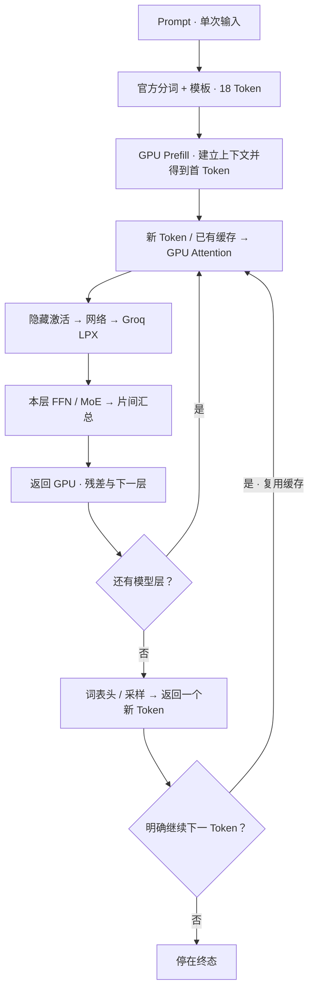
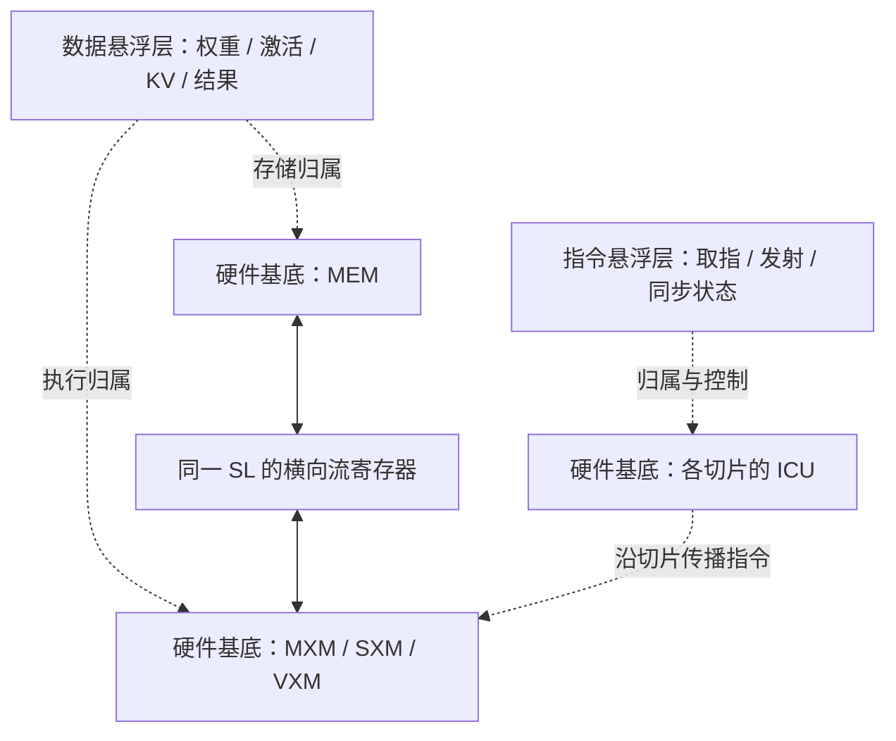
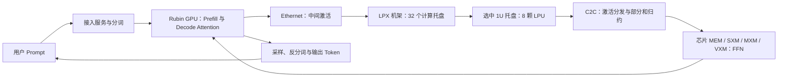
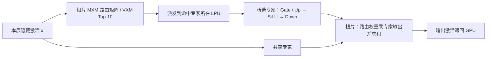

# Groq TSP 可视化解析方案

## 沉浸式重建方案

界面采用 Blender 式编辑器分区，保持亮色：工作区顶栏、左侧执行树、中央视口、右侧属性与性能、底部时间轴。默认“完整请求”连接外部输入、GPU Prefill、GPU / LPX Decode 与输出；Prefill 和 Decode 可单独展开。当前动作可在时间轴上前后定位。

Prompt 的原始 UTF-8 文本只传入一次；正文六词片在分词阶段依次传递并驻留。运动进度从起点单调推进到终点，不使用取模循环。回放结束后保持最终状态；只有重置请求才重新输入。后续 Token 的 Decode 直接复用已有缓存，不重复原句分词和 Prefill。

Rubin 外形使用 NVIDIA 官方双裸片、八组 HBM4 封装。GPU 的矩阵、向量、存储不标成 Groq 的 MXM / VXM / MEM 硬件单元；对应资源分别为 SM 内的 Tensor Core、CUDA / SFU 执行资源及存储层级。具体 SM 或 HBM 栈归属未公开，动画只定位公开资源类别。

默认入口改为一个完整的三维场景。机柜、服务器、板卡与芯片采用实体网格、金属材质、环境光、接触阴影及可展开部件。参考 Branch Education 视频的绕行和部件拆解方式，以及 NVIDIA 机架 / 托盘图中的外形、接口和部件组织。公开图没有提供的制造尺寸、内部布线与器件摆放标为示意，不以软件流程方框替代服务器外观。

操作、性能、模型选择、Token 串与播放控制全部作为三维场景中的悬浮菜单。菜单具有空间位置，通过朝向补偿保持可读；旋转硬件和观察镜头时不会翻转菜单。图表仍由 Mermaid 生成，机械实体与材质由 WebGL 渲染。

固定句子采用“谁是世界上最厉害的大模型？”。分别加载两模型的官方 tokenizer，得到六个正文 Token：“谁是”121232、“世界上最”114314、“厉害”102169、“的大”97796、“模型”103725、“？”10992。关闭 thinking 后，按官方 chat template 形成 18 个完整输入 Token。正文 Token 与模板 Token 分开显示；点击 Token 可追踪其 ID、Embedding 行和后续激活。回放中的续写句是给定示例，不冒充真实模型生成。

数据在三维空间中表现为独立字片、粒子与向量束。字片保持身份标识，向量束表示同一 Token 在 Q/K/V、状态更新、FFN / MoE 中的形状变化；没有运行真实权重时不填造激活数值。指令以紫色短语和发射脉冲显示，数据不再放进大矩形说明框。

网络操作严格区分两个模型。27B 包含 Embedding、RMSNorm、DeltaNet / Gated Attention、残差、Dense SwiGLU、最终 RMSNorm 与词表头。Flash-Next 包含四路残差扩展、第 2 层 PLE n-gram 注入、门控残差读写、DeltaNet / QSA、Top-10 路由专家与共享专家、最终门控混合和词表头。选层会切换真实分支；QSA 的块选择遵守短上下文和完整块 / 尾部的区别。

Prefill 与 Decode 有独立执行位置：依据 AFD 文章，Prefill 留在 Rubin GPU；Decode 的 Attention 留在 GPU，FFN / MoE 激活经网络进入 LPX。完整请求入口先显示分词与 GPU Prefill 概览，再进入单 Token 的 Decode 展开。可切换为 Prefill 展开，查看全部输入位置的矩阵形状；计算量随模式与模型同步改变。

验收检查包括真实 Token ID 与模板还原、两模型网络分支、PLE 只在第 2 层出现、QSA 掩码预算、Dense 与 MoE 汇总区别、空间菜单的朝向补偿、硬件数量、实体拆解、粒子运动、离线启动及屏幕适配。

## 兼容视图的解析目标

从一个 Prompt 出发，解释请求如何经过主机、PCIe / DMA、片上存储、计算单元和片间连接，最终产生 Token 并返回用户。使用者应当同时看到软件操作、执行中的指令与数据、所属硬件和对应的时间成本。

以下为保留的第一代 TSP 兼容视图。初始版本提供三种观察范围：完整请求、逐周期执行、Attention / FFN 深入。完整请求按模型形状估算成本；逐周期视图用可复算的小程序展示整数周期状态；深入视图展开完整算子和手算数值。三种范围共享页面，切换时暂停上一视图。

## 兼容视图的一屏布局与交互

| 区域 | 常驻内容 | 交互 |
| --- | --- | --- |
| 左侧软件 | 完整流程、当前操作、并排的指令与数据 | 点击环节或具体操作，前后切换动作 |
| 中间硬件 | 固定芯片区域、当前数据位置、指令传播与执行单元 | 选择芯片、展开单元、查看四片总览、跟随传输 |
| 右侧性能 | 当前和累计时间、FLOPs、字节数、有效带宽 | 展开公式与计算过程，调整模型和示例参数 |
| 底部播放 | 当前执行位置、进度、播放速度 | 播放、暂停、重播、前后步；逐周期视图支持单拍和事件跳转 |

主画面采用亮色。长说明、参数、部署和公式放入同页详情面板，打开时暂停播放。窄屏使用软件、硬件、性能标签切换，保留可读尺寸。

软件选择只改变同一硬件场景的执行状态；展开硬件只改变观察尺度。图中 Q 头、流水段和张量分片属于软件分工，不能画成额外的芯片电路。矩阵 MAC 位于 MXM 内，逐元素算术与归约位于同一中央 VXM 区域内。

## 三维分层主图

完整请求主图采用可自由旋转的三维空间。硬件、数据状态、指令状态分别保存，由同一个空间变换统一旋转、平移和缩放。鼠标拖动采用虚拟轨迹球，可绕任意轴连续转动；悬浮卡保持朝向观看者，锚点连线随空间一起变化。观察操作不改变硬件拓扑、计算值或性能账本。

| 空间操作 | 输入方式 |
| --- | --- |
| 旋转整个空间 | 左键拖动或单指拖动；可连续绕到任意方向 |
| 缩放 | 滚轮或工具栏的加减按钮 |
| 平移 | 右键拖动，或按住 Shift 左键拖动 |
| 恢复观察位置 | 点击“复位”；“俯视”切换为正上方观察 |
| 键盘操作 | 聚焦画布后用方向键旋转，Shift + 方向键平移，加减缩放，Home 复位 |

拖动与点击采用距离阈值区分，旋转结束不误触硬件详情。旋转时动画继续运行；切换步骤、数据写回或跟随 C2C 传输时，保留用户选择的空间角度。相机状态与执行时钟独立。

| 显示层 | 内容 | 约束 |
| --- | --- | --- |
| 硬件基底 | 九个功能区域、20 条 SL、分布式 ICU、主机接口与 C2C 收发路径 | 坐标和名称固定；MAC 属于 MXM，逐元素与归约资源同属一个 VXM |
| 数据悬浮层 | 权重、激活、KV、运算输入输出和收发缓冲状态 | 每张卡片指向一个明确硬件归属；数据卡不计为硬件单元 |
| 指令悬浮层 | 指令存储与执行状态、控制传输标记 | 与数据同时显示，可单独隐藏；发射者和目标切片保持可追踪 |

三维高度仅编码显示层级，不代表硅片物理堆叠。删除原先追加在 SL 下方的“同列细节视窗”，不再把软件张量或结果框画成独立电路。四片图按编译映射的功能归属显示张量，不虚构具体 SRAM 地址或 SL 分配；逐拍细节继续由逐周期模型提供。

保留一屏三栏、完整 Prefill / Decode 导航、鼠标单步、播放和实时性能。新增立体 / 俯视、数据层与指令层开关及层间距控件。C2C 数据标记在上层经过与硬件链路对应的路径，收发端状态仍在到达后更新。

实现验收：硬件标签不被数值覆盖；单片只有一个 VXM；全部悬浮对象有有效硬件归属；隐藏图层不改变计算或播放；SL 在所有功能列共用行坐标；三维相机、缩放与传输路径同时对齐。

## Groq 3 原图空间

### 固定菜单与逐层进入

操作菜单固定吸附左侧，性能菜单固定吸附右侧。仅中央硬件场景参加旋转、平移与缩放；两侧文字保持原位和正向。参考 [Branch Education 的分层观察方式](https://www.youtube.com/watch?v=fCS8jGc3log)，将镜头层级扩展为外部系统、LPX 机架、选中槽位的 1U 计算托盘、托盘内八颗 LPU 的互联，以及选中的芯片内部。通过面包屑返回上一级，点击槽位或芯片选择对象，再进入内部。

依据 NVIDIA 文章图 1、图 2、图 3 和 AFD 示意，机架重建 32 个计算托盘，每托盘 8 颗 LPU、Host CPU、Fabric Expansion Logic / DRAM、DPU 或 NIC、前部 400 Gb/s Ethernet 和 C2C 光连接、后部 C2C spine 接口。编号表示本页观察索引，不等于机柜 U 位。未公开的板内链路映射只显示功能连接，不绘制推断的完整物理拓扑。

Qwen/Qwen3.8-27B 使用官方配置的 64 层、隐藏维度 5120、FFN 中间维度 17408，并区分 48 个 Gated DeltaNet 层和 16 个完整 Attention 层。以 FP8 权重、BF16 激活、FFN TP2 的明确假设展示映射：每层 FFN 占两颗 LPU，每托盘四层，共 16 个托盘、128 颗 LPU；这个映射是本页示例，未声称模型已在 LPX 部署。

Qwen3.8-Flash-Next 根据[官方配置](https://huggingface.co/Qwen/Qwen3.8-Flash-Next/blob/main/config.json)与[模型卡](https://huggingface.co/Qwen/Qwen3.8-Flash-Next)重建 MoE 路径：48 层、D=2560、512 个路由专家、Top-10 加一个共享专家，专家中间维 640；36 层 Gated DeltaNet 与 12 层 Qwen Sparse Attention 留在 GPU。主模型标称 125B、约 6B 激活参数；另列 51B n-gram embedding 和 4B MTP。总权重容量表按 180B 的语言部分口径估算，不把 6B 激活规模当成常驻权重。

Flash-Next 示例采用专家并行：FP8 每层八片、每片 64 个路由专家；BF16 每层十六片、每片 32 个路由专家。根片另承载共享专家和路由矩阵。分别占 48 个托盘 / 2 个机架、96 个托盘 / 3 个机架。页面提供机架与专家选择，跨托盘的所选专家通过 C2C spine 进入当前托盘。动画跟踪十个示例命中专家之一，同时标记其他参与芯片；路由编号为情景输入，不伪称计算了真实 Prompt 的路由分数。

Prompt 文本字节由实际输入计算，Token 数是可修改的情景输入，不伪造分词结果。Prefill 与 Attention 显示在 GPU 上；进入 LPX 的是中间激活。托盘内跟踪同一 Token 的激活复制、两颗 LPU 的 FFN 分片和 FP32 部分和求和，再返回 GPU。链路序列化、矩阵峰值下界和权重容量分别列账，未公开的固定延迟不补造为实测值。

以 NVIDIA [官方文章图 3](https://developer-blogs.nvidia.com/wp-content/uploads/2026/03/Groq-3-Architecture.webp)作为本次重建对象，按白色边界重建七条中央功能区、ICU、C2C 和 CCU / GPIO 的相对位置。每个体块拥有六个 Mermaid 表面，顶部采用可关闭的官方在线纹理。支持自由旋转、整体缩放、平移、俯视和复位；指令与数据保持独立的悬浮位置。

原有第一代 TSP 请求与逐周期模型保留在各自入口。Groq 3 视图只使用新文章的公开结构与指标，不混用旧代 SL、容量、链路数和时序。运行示意只表达资源关系，未公开的算子延迟明确显示为未公开。离线时纹理回退到内嵌的纯色分区，旋转与播放继续可用。

## Prefill / Decode 完整流程

左侧始终显示八个环节，共 42 个具体操作。当前环节高亮，指令和数据卡更新当前动作，完整流程不会被局部操作替代。

| 环节 | 具体内容 |
| --- | --- |
| 输入准备 | 外部请求、CPU 分词、绑定模型副本、运行时提交 |
| 接入与嵌入 | PCIe / DMA、MEM 落地、Embedding、同段 TP 激活分发 |
| QKV | RMSNorm、Q / K / V 投影、RoPE、KV 追加 |
| Attention | 读取 KV、QKᵀ、缩放与因果遮罩、Softmax、概率精度转换、PV、头布局重排 |
| 输出投影 | Wo、跨片 All-reduce、残差 |
| FFN | RMSNorm、Gate / Up、SiLU、逐元素门控、Down、All-reduce、残差 |
| 模型层与流水段 | 本段剩余层、C2C 交接、后续阶段、最终 Norm、词表头 |
| 输出与下一轮 | logits 返回主机、采样、反分词、发送用户、下一轮 Decode |

Prefill 一次输入 T=S 个位置并建立 KV。Decode 输入 T=1 个新 ID，复用原连接、模型副本和 S−1 个历史位置；本轮追加一个 KV 位置，采样结果成为下一轮输入。热请求不重复部署模型，Decode 不重新分词原始 Prompt，也不搬迁全量历史 KV。

每个流水阶段展开一层，剩余层通过重复操作计入。跨段后从下一段的 Norm 继续，末段才执行最终 Norm 和词表头。独立的 KV 读取说明不重复计入 QK / PV 的访问；Wo / Down 归约之后再单独执行残差。

## 多芯片分工与传输

四片示意板支持 PP2 × TP2、PP4、TP4 和两个模型副本。请求先绑定副本；模型层确定经过哪些流水阶段，同层的矩阵维度确定各片负责哪些头和 FFN 通道。

同段各片接收相同 Token 的激活，分别使用自己的权重。Wo 和 Down 产生 D 维部分和，需要跨片求和；后续流水段接收隐藏激活。权重和已有 KV 留在所属芯片，切换观察视角不会迁移数据。

传输动作依次经过源 MEM、发送缓冲、SerDes、C2C 连接、接收与 Deskew、接收缓冲和目的 MEM。未到达前保留旧状态，到达后才更新部分和、缓存或输出。右侧将读取、序列化、传播、对齐、写入和等待分别列账。

## 逐周期指令与数据

周期 C 表示第 C 个边沿之后的状态。同拍先提交到达和计算结果，再按静态计划消费；所有状态只在整数边沿变化，慢放只改变观看速度。左侧同时列出各 ICU 的符号化指令和对应数值，中间显示有效流寄存器、SRAM、MXM / VXM / SXM，右侧读取同一周期快照。

微程序覆盖矩阵点积、RoPE、SiLU、Softmax、RMSNorm、Sum、重排、内存访问和静态同步。每个物理切片每拍的发射、20 个 Superlane 的 19 拍偏移、SG2 / SG4 的字节流对齐和最后写回都可逐项核对。回退时重建状态，清除未来结果。

程序和输入在这一视图开始前已装入芯片。地址、寄存器、距离、功能延迟和可见 4×4 窗口是示例安排；指令名称为符号化展开，不代表真实二进制反汇编。公开机制与参数假设在资料和时序面板中分别说明。

## 算子与数值深入

| 类别 | 典型操作 | 主要硬件 |
| --- | --- | --- |
| 矩阵 | QKV、QKᵀ、PV、Wo、Gate / Up / Down | MXM，操作数来自 MEM 和流寄存器 |
| 向量 | RoPE、SiLU、缩放、Add、门控 | VXM；SXM 配合元素对齐 |
| 归约 | Sum、Max、RMSNorm、Softmax | VXM 算术链，必要时配合重排 |
| 重排 | Transpose、Permute、头布局 | SXM 与流寄存器 |
| 存储 | 权重、KV、激活和程序的读写 | MEM；外部接入使用 PCIe / DMA |
| 控制 | IFETCH、发射、等待、SYNC / NOTIFY、Repeat | 分布式 ICU 与静态计划 |

算子专题按操作类型提供 30 个独立操作。单片深入视图提供 34 步完整计算链，以及 3 个位置、D=4、H=2、G=1、F=6 的手算例子。小窗口展示数值，右侧按完整模型形状计成本，两者的规模始终明确。

## 验收口径

验收包含流程完整性、数据依赖、硬件端点、片间归约、数值、单位、参数边界、周期重放、唯一播放源、离线打包和网上资料引用。图形统一使用 Mermaid。具体公式与硬件映射见 [设计说明](设计说明.md)，检查方式和边界见 [验证说明](验证说明.md)。

完整流程的参数化分镜和逐周期视图的模拟时钟采用不同时间口径。验证只能支持模型自洽，不证明真实 Groq 编译程序、硅片周期或在线服务性能。
