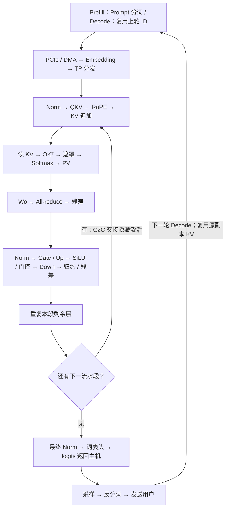
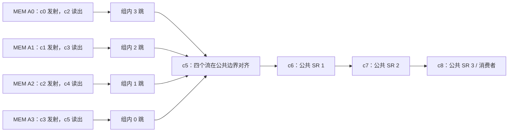
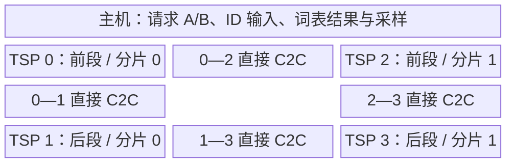
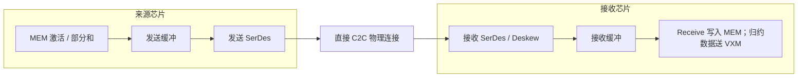
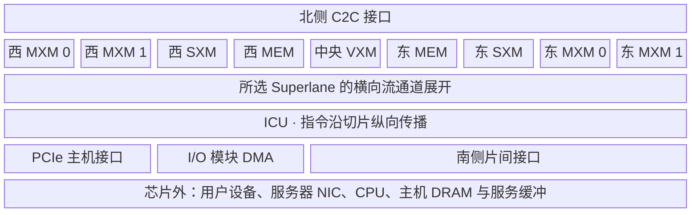

# 软件、硬件与性能实验台设计说明

## 完整请求导航

默认进入 Prefill / Decode 完整流程。左侧由常驻八环节、具体操作选择和当前指令 / 数据卡组成；当前动作不会替代完整流程。八环节由 Mermaid 生成，42 个具体操作直接连接算子分镜、固定硬件坐标和对应成本模型。

Prefill 的本轮长度 T=S；Decode 的 T=1，历史为 S−1。各流水段只展开一层，其余层通过单独的重复操作展示；阶段交接后回到下一段的 Norm，末段才执行词表头。输入流程不将部署、原始 Prompt 分词或全量 KV 搬迁重新计入每次 Decode。

KV 写入后的状态在后续算子中保留。Wo / Down 的归约仅完成部分和合并，残差在下一操作单独讲解。右侧当前操作按本片分工计量；最终 Norm 使用完整 D 维，词表头按词表分片计量。读取 KV 的独立展开已经包含于 QK / PV；其余层预算已经包含于 L 层路径，均不再次累计。详细模型和验证范围见 [教学方案](教学方案.md) 与 [验证说明](验证说明.md)。

## 逐周期视图

逐周期课堂使用独立的整数时钟模型。左列同时显示当前 SL 的指令和数据；中列展现 128 个 Mermaid 硬件节点；右列所有数字来自同一整数周期快照。切换课堂时统一暂停，键盘只控制当前入口。

周期 C 表示时钟边沿之后的状态。消费 = 发射 + SL 编号 + d_skew；产生 = 消费 + d_func；公共路径到达 = 组边界产生周期 + h 跳。SG4 组内切片另有 0—3 拍空间错位，物理计划将其展开，不能把 Read×4 当作一条真实指令。每个物理 MEM 切片每拍最多发射一条指令，SR 的 valid 只在所在周期为 1。

FP32 的 SG4 包含四条字节流；每条流在一个 SL 占 16 B，因此全宽 SG4 为 64 B / SL，20 个 SL 共 1280 B。FP16 的 SG2 相应为 32 B / SL。只显示前四个逻辑 lane 的数值并明确剩余位置后续数值不模拟，不把可见四个数当成整个物理向量。

下面是默认 h = 3、d_read = 2 的 SG4 输入对齐示例，图形使用 Mermaid。发射偏移和空间分配是教学选择。

复杂算子分解为重排、逐元素算术和 SRAM 中间结果；输出只在最后字节平面写回之后出现。模型支持任意回退并重建状态。详细时序依据、教学假设和验证边界见 [教学方案](教学方案.md) 与 [验证说明](验证说明.md)。连续分镜课堂的空间、计算与通信模型如下。

## 一屏界面

主画面由紧凑工具栏、固定高度的三栏内容和统一播放栏组成。页面、软件栏、硬件画布和实时性能栏不再各自形成长滚动区。左侧始终展示八个完整流程环节；当前指令与数据缩为同一个并排卡片，前后动作按钮只切换当前硬件分镜。详细算子分类与长步骤列表在同页详情中查看。

中间在同一组 Mermaid 坐标中改变观察范围，默认展示当前执行位置。点击芯片后完整显示其功能区和接口；四片总览保留板上位置；跨片传输在发送与接收芯片之间移动镜头。芯片和内部单元的物理坐标不随软件步骤改变。

右侧常驻当前延迟、累计时间、算量、流量和带宽。完整多层路径、逐项公式、手算数值、软件分工、容量和参数在同页侧边面板中查看，打开面板会暂停播放。窄屏改为软件、硬件、性能标签切换，以保留可读尺寸。

Mermaid 软件节点的标签组归零，文字在节点中心换行，较长内容可通过当前动作详解查看。验证范围见 [验证说明](验证说明.md)。

## 三列联动与硬件归属

桌面宽屏左列显示软件流程，中列显示固定硬件图，右列显示实时性能。两种课堂均采用这一布局。左列的指令与数据是同一软件操作的两个观察角度：点击任一行，由同一播放引擎定位中间硬件动作并更新右侧累计估算时间。图形全部由 Mermaid 源图生成并内嵌到独立 HTML。

四片课堂提供六类 30 个操作：9 个矩阵操作、6 个向量操作、4 个归约操作、3 个重排操作、4 个存储操作、4 个控制操作。分类按学习重点划分，Softmax、Norm 等复合算子同时需要多个类别的资源。

Q、K、V 与 FFN 投影在 MXM 中计算。“Q 头”描述张量分组，不是一块电路。中央 VXM 只保留一个功能区域，逐元素 ALU 与归约状态都在其内部。MEM 区分程序、权重、激活和 KV；IFETCH 从程序区到 ICU，VXM 不执行 SRAM Load / Store。分布式 ICU 汇总画成一条说明带，不表示芯片只有一个控制器。

副本、段和分片出现在软件部署说明中。段对应不同模型层，分片对应同层的矩阵维度，副本对应独立部署与请求缓存。每片标题只标硬件身份，不把软件角色当作电路名称。超容量配置保留机制演示，但明确不代表数据已成功装入设备。

算子课堂的指令名称是教学执行计划，不是从真实编译器导出的汇编。矩阵例子逐项计算 `[1,2,3,4]·[2,0,−1,3]=11`；向量、归约与重排各有独立小例子。右侧始终按当前模型的本片完整形状估算，避免用小例子的四个数反推芯片性能。

矩阵和向量操作复用已有本片成本模型。重排以元素流量、MEM 读写量和可修改的 SXM 有效吞吐估算；控制以可修改的时钟、等待和重复次数计算预设指令时序，矩阵 FLOPs 为零。这些假设单独展示，不作为公开硬件的实测周期。独立操作预算不会再次累加到完整层路径中。

## 四颗芯片的模型分工

完整请求、逐周期和单片深入三个课堂位于同一页面。左侧显示软件分工与执行流程，中间固定展示各片硬件，右侧同步显示容量、算量与通信成本。模型形状与 Prefill / Decode 在两种观察范围间共享。页面、Mermaid 芯片图、寄存器、控件和弹窗统一为亮色。

| 部署方式 | 模型层分配 | 同层分片 | 请求与 KV |
| --- | --- | --- | --- |
| 默认 PP2 × TP2 | 前段：TSP 0、2；后段：TSP 1、3 | 每段各片分担 Q 头与 FFN 通道 | 请求依次经过两段 |
| PP4 | 按 0、1、3、2 的物理邻接次序分层 | 每段一片 | KV 留在负责该层的芯片 |
| TP4 | 四片共同处理所有层 | 环顺序 0、1、3、2 | 各片保存对应头的 KV |
| 两副本、每副本 PP2 | A：0、2；B：1、3 | 每段一片 | 请求保持副本绑定，缓存隔离 |

PP 是流水阶段数，TP 是每段张量分片数。软件先放置模型层、权重与 KV 地址，请求再沿分工执行；不是为相邻 Token 轮流选择单独一颗芯片。同段各片层范围相同，Q 头与 FFN 通道连续切分、不重不漏。

GQA 中查询头 h 使用 KV 头 floor(h/(H/G))，每片保存它需要的 KV 头集合。默认 H=8、G=2、TP=2 时 KV 不复制；TP=4 时同一 KV 头被两个查询分片使用，本页选择复制相应权重和历史，并计入容量。

295 个 Mermaid 节点固定展示四颗芯片。各片包含九个功能分区、MEM 程序和权重、输入和 KV、MXM 内的 MAC、VXM 内的逐元素与归约 ALU、流寄存器通道、ICU、PCIe / DMA、发送缓冲、SerDes、接收 / Deskew 及可见接收槽。点击芯片查看归属，在算子课堂可切换其本片执行；点击物理连接在原位演示收发。图中的区域窗口不等于实际执行单元数量。

## Token 激活如何经过片间硬件

整数 ID 先提交到副本入口，查词嵌入后成为 FP16 激活 X=[B,T,D]。同层各片需要相同 X，分别与本地权重相乘。阶段交接时，本页让来源分片向下一段对应分片传递完整 X；下一段无需再次广播同一份 X。权重和历史 KV 留在原阶段。

演示显示第几个 320 B 向量、有效字节范围、填充、接收窗口与写入状态。到达前保留旧值；到达后才更新接收方部分和、KV、目的 MEM 和采样 ID。多跳路径经过中继接收与发送单元。动画进度是慢放时间，不等于芯片时钟。

Send / Receive、320 B 向量、16 条 ×4 C2C 来自 ISCA 2020；HAC / SAC、SYNC / NOTIFY、运行时 Deskew 和软件收发节奏来自 Hot Chips 34。片间对齐不表示全部芯片具有无偏差的共同全局时钟。四片布线、模型分工和环形算法为选定教学方案，不表示 GroqCloud 当前私有部署。

## 张量分片中的 Attention 与 FFN

| 算子 | 每片负责的部分 | 合并方式 |
| --- | --- | --- |
| Q 投影 | Wq 输出列，本片 H/P 个查询头 | 各头独立执行 Attention |
| K / V 与 KV | 本片查询头所需 KV 头；必要时复制 | 按请求、层、头、位置保存 |
| QK、Softmax、PV | 本片查询头与所需 K/V | 不在不同头之间归约概率 |
| Wo | 按拼接头维度切分输入行 | 每片产生完整 D 维 FP32 部分和，需要求和 |
| Gate / Up | Wg、Wu 各切输出列 F/P | 中间结果留在本片 |
| SiLU 与门控 | 本片 F/P 个通道 | 无跨片通信 |
| Down | Wd 按输入行 F/P 切分 | D 维 FP32 部分和需要求和 |
| 词表头 | 末段按词表列 V/P 分片 | 主机按索引汇合分数，不求和 |

Wo / Down 的输出不能直接拼接。环形归约先进行 P−1 轮 Reduce-scatter，每轮接收方把收到的块与本地同块相加；再进行 P−1 轮 All-gather，只复制已求和的块。最终每片获得相同向量，再加一次残差。

四个数的独立小例子中，第 r 片贡献 (r+1)×[1,2,3,4]。TP2 最终为 [3,6,9,12]，TP4 为 [10,20,30,40]。表格逐轮保留已完成的值，当前传输另列；与单片 Attention 小例子的数值规模分开。

## 多片账本公式与边界

令 P 为每段分片数，A=BTD×2 B 为阶段激活，M=BTD×4 B 为每片归约部分和。

| 项目 | 计算关系 |
| --- | --- |
| C2C 有效单向 B/s | lane Gbit/s × 10⁹ × 4 × 使用链路数 × 有效率 / 8 |
| 槽位预算 | ceil(有效字节 / 320) × 320 B |
| 窗口数量 | ceil(槽位数 / floor(窗口 KiB×1024/320)) |
| 传输重叠估算 | max(发送读取、序列化、接收写入)+传播+对齐+窗口等待 |
| 传输串行估算 | 发送读取+序列化+接收写入+传播+对齐+窗口等待 |
| 归约每轮每片发送 | M/P，共 2(P−1) 轮 |
| 归约每片总发送 | 2(P−1)M/P；全组总发送为 2(P−1)M |
| 每片归约加法 | (P−1)BTD/P，以有效向量吞吐估算 |
| 阶段交接 | 每条流发送 A，时间取各并发路径最大值 |
| 单请求 L 层路径 | 各阶段本地计算、每层两次归约与阶段交接相加 |
| 满流水理想间隔 | 最大阶段服务时间，含本页分配给该阶段的交接 |

默认一条 ×4 链路使用 30 Gbit/s、80% 有效率，得到 12 GB/s。每邻接最多 8 条链路，每片最多两个邻接；全片 16 条接口的带宽不会重复分给每条连接。320 B 为指令向量粒度，不是完整线上报文；线码、FEC、真实协议和编译器分块未逐比特模拟。

多片累计只含 L 层计算、两次归约和交接，不含入口广播、词嵌入、最终归一化、词表头、PCIe、CPU 和外网，不称为完整 TTFT / TPOT。词表页另按本片矩阵规模计算，其输入读取和固定开销不随分片数除小。时间为参数估算，串行口径也不构成真实延迟上界。

本地计算按 Q 头、KV 集合和 FFN 通道缩放；归一化与残差在各分片复制。Wo / Down 输出按 FP32 部分和计读写，归约之后的残差和精度转换在本地成本中各计一次。跨片通信另计。

每片权重包含模型层、头和通道分片、归一化参数、入口嵌入及末段词表。输入和输出分处不同芯片时，必要的物理副本分别计入；同片重合部分只计一次。每片 KV 容量为 2×B×S×本片 KV 宽度×2 B×本片层数×常驻请求组数；工作区与收发窗口另计。

分片形状不适配或活动芯片容量不足时，不显示完整层路径估算。通过容量下界不等于已编译部署成功。流水表的列是教学调度槽，任务须在前序阶段完成后到达；并发的是独立请求，同一请求下一枚 Token 必须等待采样结果。新 ID 回到原副本，观察视角切换不会迁移 KV。

单片深入课堂的详细设计如下。

## 同一个硬件场景，三列同步观察

左侧负责回答“软件安排了什么指令、需要哪些数据”；中间负责回答“数据在哪个硬件里、哪个单元在做什么”；右侧负责回答“做了多少计算、搬了多少字节、这些成本对应多少时间”。选择算子改变其执行状态，选择硬件改变观察位置和展开尺度。

同一 Mermaid 主图只装载一次。MEM、MXM、SXM、VXM、ICU、PCIe、DMA 与芯片外服务区的对象始终保留。选中的切片在所属区域原位展开；点击 MAC 后，阵列与该 MAC 内部同时保留在同一 MXM 区域。其他分区收窄，但顺序与方向保持。

主图中的 20 个 Superlane、功能区域与数据传播方向来自第一代 TSP 的公开组织。MEM 的 8 列为切片的压缩示意，4×4 MAC 与 4 个 VXM 操作槽是可读的展开窗口；实际切片数、lane 数与执行资源规模并未缩成这些教学维度。展示坐标不代表门级布线。

## 请求如何抵达计算资源

| 阶段 | 硬件动作 | 单独计算的成本 |
| --- | --- | --- |
| 外部请求 | 用户设备发送 UTF-8 正文，服务器 NIC 接收 | 正文字节、链路序列化、RTT/2、请求排队 |
| CPU 输入准备 | 主机分词，int32 ID 留在 DRAM | 设定分词吞吐与固定准备时间 |
| 运行时提交 | 组织输入缓冲、设备任务与 DMA 描述符 | 可编辑的提交预算 |
| PCIe 传输 | 主机数据经 PCIe 到设备 I/O DMA | B×T×4 B、有效单向带宽与固定开销 |
| MEM 落地 | DMA 的数据写入片上输入缓冲 | ID 的片上写入字节 |
| 词嵌入 | MEM 根据 ID 查表，读出 D 维向量 | ID 读取、嵌入行读取与可选中间写回 |

模型权重与已编译程序在部署阶段准备。热请求不重复传输全部权重。冷部署权重传输单独显示，未将磁盘、编译、分片等未建模成本混入每次请求。

主机采样为本页选定的接入方式：词表 logits 经 DMA / PCIe 返回主机，CPU 选择 ID、增量解码，再经 NIC 发给用户。下一轮 Decode 复用连接与历史，只提交新 ID。输入侧 MEM 写入与 PCIe 接收在账本中分项列出；输出侧 DMA 读取与 PCIe 传输分别给出重叠、串行两种估算。

## Attention 与 FFN 的硬件归属

| 计算 | 放置与可观察动作 |
| --- | --- |
| RMSNorm | VXM：逐项平方、归约均值、倒数平方根、缩放并输出 |
| Q / K / V | MEM 取矩阵权重，MXM 输入寄存器接收激活，MAC 形成乘积与部分和 |
| RoPE | SXM 对齐成对元素，VXM 执行旋转；V 不经过该旋转 |
| KV 追加 | 旋转后的 K 从 VXM 输出写入 K 区；V 投影写入 V 区；Decode 保留旧历史 |
| QKᵀ | MEM 读 K，MXM 逐查询头计算与 Q 的点积 |
| 缩放与遮罩 | VXM 将得分除以 √d，未来位置设为 −∞ |
| Softmax | VXM 每行依次求最大值、exp、分母 Z 和 P=e/Z |
| 概率转换 | VXM 将 FP32 概率转换为本模型采用的 FP16 矩阵输入格式 |
| PV | 概率与 MEM 中的 V 在 MXM 相乘、求和 |
| 合并与输出投影 | SXM 对齐各头；MXM 执行 Wo；VXM 与原始输入加残差 |
| SwiGLU | MXM 分别计算 Gate、Up；VXM 做 SiLU 与逐元素乘；MXM 执行 Down；VXM 加残差 |
| 词表头 | 最后位置归一化后，MXM 投影到词表分数 |

QK 与 PV 中的 K/V 是动态激活，作为该次矩阵乘法的右操作数装入矩阵资源；不能把它们当作训练好的固定参数。KV 存储格不会执行 Softmax 或加权累加。指令沿 ICU 对应的消费者切片纵向传播，数值跨区域时经过所属流寄存器。

## 可手算的小数值链

固定 3 个位置、D=4、两个 Q 头共享一个 KV 头、每头 d=2、F=6。数值链包括 RMSNorm、Q/K/V、RoPE、因果注意力、两头拼接、Wo、残差、第二次归一化、SwiGLU 与层末残差。最终归一化取该数值例子一层输出的最后位置。

Prefill 展示三行；Decode 展示最后一行查询，K/V 仍保留三行。因此同一历史下最后位置的输出可以相互核对。归一化例子的 γ=1，ε=0.00001。数值运算使用 JavaScript 数值精度，显示保留三位小数，没有模拟 FP16 舍入。

MAC 只能展开示意窗口内的单元；F=6 的完整 Down 点积仍有六项。图上明确标出可见项数，图下表格给出完整操作数和点积，右侧始终按完整模型形状计成本。窗口数量不能用于反推右侧的全芯片吞吐。

## 性能公式与单位

令 B 为批量，S 为有效上下文长度，T 为本轮输入位置数，D 为隐藏维，H 为查询头数，G 为 KV 头数，d=D/H，F 为 FFN 中间维，L 为层数，V 为词表大小。Prefill：T=S；Decode：T=1，历史长度为 S−1。

| 项目 | 计算关系 |
| --- | --- |
| Q、Wo | 各 2BTD² FLOPs |
| K、V 投影 | 各 2BTD(Gd) FLOPs |
| QK、PV | 各 2BH×配对数×d FLOPs；一般配对数为 TS |
| 跳过因果上三角 | Prefill 配对数改为 S(S+1)/2；需要额外算法与调度假设 |
| Gate、Up、Down | 各 2BTDF FLOPs |
| 逐元素门控 | BTF 个等效向量运算项 |
| 词表投影 | 2BDV FLOPs，只计算最后有效位置 |
| KV 容量 | 2×B×S×Gd×2 B×L |
| 每层新增 KV 写入 | 2×B×T×Gd×2 B |
| 单次 ID 输入 | B×T×4 B |
| 主机采样例的 logits 返回 | B×V×4 B |

每次乘并累加计 2 FLOPs。矩阵输入、权重及 KV 为 2 B 元素；得分和 Softmax 暂存为 4 B 元素。PV 之前独立计算精度转换，避免用 FP32 输入假设直接套用 FP16 峰值。

矩阵时间为 FLOPs / 有效矩阵吞吐；片上搬运时间为字节数 / 有效片上带宽；向量非线性与归约按可编辑的等效吞吐估算。每个算子分别使用 `max(计算, 搬运)+固定开销` 和 `计算+搬运+固定开销` 两个口径，再逐算子、逐层累计。真实分块可能重读数据，实际延迟可能超过这里的串行值。

容量使用 MiB / GiB；带宽使用十进制 GB/s / TB/s。网络输入以 Mbit/s、NIC 以 Gbit/s 设置，转换为 B/s 后取两者的较小值。PCIe 使用单向 31.5 GB/s 的参数口径，再乘有效率。固定开销、利用率、CPU 与向量速度都属于演算假设。

中间写回开启时，逐项登记中间张量写入与下一步读取；关闭时，同时去掉这些中间写入与读取，表示理想转发下界。仍保留模型权重、词嵌入查表、输入 ID、历史 KV 读取、新 KV 写入和外部返回所需的访问。该模型未验证这种转发能否在真实寄存器与编译资源上实现。

## 首片段与连续输出

TTFT 累计请求网络、CPU 准备、PCIe 输入、L 层、最终归一化、词表头、主机采样与首次返回。冷部署单独列出。

Decode 的本轮到达时间包含返回的固定单程传播；连续片段的稳态 TPOT 去掉这个不会逐片段叠加的传播项。每个请求的连续输出速率为 `1000 / TPOT(ms)`。序列化、采样和本轮计算仍计入 TPOT；真实服务可有更多重叠与调度成本。

容量不足时，整模型延迟、输出速率与累计时间不显示。最低芯片数只是容量相除后的下界，不构成多芯片放置或性能预测。通过容量下界也尚未验证真实切片分配、指令空间、碎片与编译可部署性。

## 资料与验证边界

- [ISCA 2020 原论文](http://pkamath.com/publications/papers/tsp-isca20.pdf)：第一代功能切片、流通道、PCIe 接入和 DMA。
- [Hot Chips 34 官方演讲](https://hc34.hotchips.org/assets/program/conference/day2/Machine%20Learning/HotChips34%20-%20Groq%20-%20Abts%20-%20final.pdf)：片间同步、Deskew、模型并行与 All-reduce。
- [ASAP 2022 原论文](https://arxiv.org/abs/2206.11062)：Attention、FFN 的硬件执行与主机通信。
- [GroqChip v1.5 产品资料](https://manuals.plus/m/3c668117454870c4f21fdd1d653ac2168bf523a305b16db5c9a800ca5a0186a1.pdf)：FP16 峰值、片上 SRAM 容量与带宽、PCIe 接口。
- [GroqCard v1.5 产品资料](https://www.bittware.com/files/GroqCard%E2%84%A2-Accelerator-Product-Brief-v1.5-.pdf)：板卡与主机接口资料。

本页的 GQA、因果解码器与 SwiGLU 是选定的教学模型；使用上述公开硬件结构解释其计算，不宣称复现某个在线服务的私有部署。正文、Token ID、候选片段与数值例子的规模分别标注。

验证覆盖纯计算、单位、增长关系、数值链、分片、归约、数据依赖、全部分镜端点、硬件包含关系、六类算子、播放联动、UTF-8、脚本语法与离线打包。播放检查执行真实应用代码和动画时钟，界面与绘图适配器使用程序替身；网页本身未进行浏览器点击、截图或视觉回归测试。事实依据均通过公开网上链接引用；原文的在线访问核对与自动化功能检查分别记录。检查方式、覆盖组数与限制见 [验证说明](验证说明.md)。
