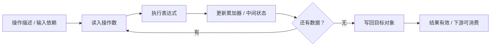

# 语义动画设计

目标读者为芯片设计与算子开发者。每次画面变化必须对应可解释的状态变化；不再使用无对象身份的粒子飞行代替计算。

## 数据与执行模型

1. 分词按官方结果逐个揭示：先高亮原文范围及 UTF-8 字节范围，再将该 Token ID 追加到结果序列。后面的 Token 不提前出现。这个顺序用于阅读分词结果，不伪称复现 BPE 内部的合并过程。
2. 算子拥有独立事件序列。事件声明所读对象、所写对象、执行资源、表达式及生效条件。回放、单步和回退读取同一份不可变状态快照，不依赖动画帧。
3. 硬件实体保持原位。数据用具名矩阵、向量、操作数寄存器、累加器和接收缓冲区显示；当前访问位置高亮。硬件上仅高亮本次涉及的资源类别，浮动标签不随机移动。
4. 矩阵乘采用可复算的 4 × 3 示例，依次展示取操作数、乘加更新和写回。Gate、Up、SiLU 与 Down 共享同一组算例数据。显示的是数学依赖事件，不冒充 Groq 指令或硬件周期。
5. Attention 的 QK、Softmax、PV 使用连贯的缩小算例；完整模型形状同时保留。没有模型权重时，词嵌入显示 E[id,d] 与逻辑索引，不编造实际模型激活。
6. 传输用一个明确的 BF16 示例负载展示描述符、分段接收、接收背压、已接收字节、完整性与结果有效信号。valid / ready 是逻辑接口算例，不是对 CX-9 或 C2C 实际协议的断言。各节点的接收完成事件是下游消费的先决条件。
7. 默认可单步到下一事件，也可连续播放。一次只改变本事件涉及的状态；输出在依赖满足前显示未就绪。操作之间沿完整模型流程前进，Token 不重复从外部注入。

## 画面组织

左侧、右侧与底部操作栏保持原有布局；中央恢复完整三维视口。计算窗口悬浮在硬件上方，采用实际空间位置、倾角与边框厚度，不再占据一块固定的二维屏幕分区。

窗口内部上下两块：上方用 Mermaid 常驻显示从 Prompt、分词到 Prefill 首 Token，以及 Decode 中 GPU / LPX 往返与后续 Token 的完整数据 flow；下方展开当前算子的操作数、具体表达式、寄存器和写回。点击上方节点可定位对应算子，当前节点与下方内容同步。

数据窗口使用独立且固定方向的透视相机，与硬件同属一个场景；中央硬件旋转不会改变窗口的位置、朝向或大小。窗口内的减号、加号、百分比复位以及鼠标滚轮只缩放窗口，保持两块内容的比例，不改变算子、硬件镜头或左右菜单。右侧继续显示完整模型形状、算量、来源及当前算例进度。

动画事件序号不等于 cycle，播放秒数不等于 latency。缩小数值算例、官方 Token 与真实模型形状分别标明；不能把算例结果解释成本句的真实推理输出。
